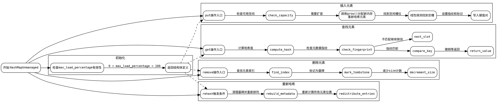

嗯，我需要为这个Zig语言的HashMapUnmanaged函数绘制一个流程图。首先，我得理解这个函数的结构和主要流程。看起来这是一个泛型哈希映射的实现，包含初始化、插入、删除、查找、扩容等操作。

首先，我应该确定这个函数的主要组成部分。比如，结构体定义、元数据处理、哈希计算、插入逻辑、扩容机制等。然后，将这些部分分解成流程图中的不同节点。

接下来，考虑流程图的起点。可能从HashMapUnmanaged的初始化开始，然后根据不同的操作分支，比如put、get、remove等。每个操作都会有条件判断，比如是否达到最大负载，是否需要扩容，如何处理哈希冲突等。

在绘制过程中，需要注意循环和条件分支。例如，插入元素时可能需要线性探测找到合适的槽位，或者在扩容时需要重新分配内存并重新哈希所有现有元素。

还有错误处理的部分，比如内存分配失败时的处理，这些也应该在流程图中体现出来。

可能需要分多个子图来表示不同的功能模块，比如初始化、插入、查找、删除、扩容等。每个子图内部详细展示步骤，并通过箭头连接表示流程顺序。

另外，代码中的一些关键函数，如growIfNeeded、allocate、deallocate等，也应该在流程图中有所体现，展示它们如何被调用以及影响主流程。

最后，确保流程图的逻辑清晰，步骤分明，能够直观地反映代码的执行流程和各个部分之间的关系。
================================================
