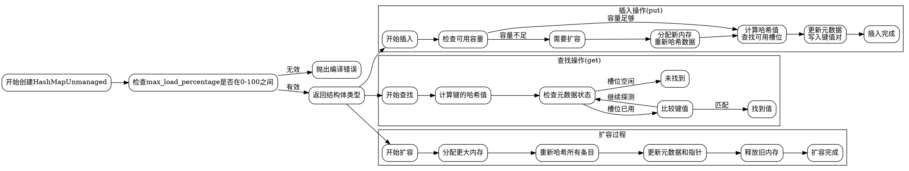

好，我需要为这个Zig语言编写的HashMapUnmanaged函数绘制一个流程图。首先，我需要理解这个函数的结构和主要功能。这个函数看起来是一个泛型哈希映射的实现，包含初始化、插入、删除、查找、扩容等操作。

首先，我应该确定流程图的主要部分。通常，流程图会从入口点开始，然后根据不同的操作分支展开。不过，因为这个函数返回的是一个结构体类型，里面包含了很多方法，可能需要为每个主要方法绘制子流程图。

比如，初始化部分，当创建HashMapUnmanaged时，会检查max_load_percentage的范围，然后返回结构体。结构体内部有各种方法，如put、get、remove等。每个方法可能有自己的流程，比如put需要处理哈希冲突、扩容检查等。

接下来，考虑扩容的流程。当插入元素时，如果当前容量不足，会触发grow操作，分配更大的内存，重新哈希所有现有元素。这个过程需要详细画出判断条件、内存分配、数据迁移等步骤。

另外，处理哈希冲突的方法，比如使用开放寻址法，结合元数据（Metadata）来管理槽位的状态（空闲、已用、墓碑）。这在查找和插入时需要检查元数据的状态，可能需要循环直到找到合适的槽位。

还需要考虑错误处理，比如内存分配失败时的回退操作。例如，在growIfNeeded中，如果分配失败，会尝试查找现有项，否则返回错误。

对于每个方法，需要明确其步骤。例如，getOrPutAssumeCapacity会计算哈希值，查找现有键，处理冲突，更新元数据，返回结果。这些步骤需要用图形化的方式表示出来，包括判断节点、循环节点、操作节点等。

由于用户要求使用Graphviz而不是Mermaid，我需要确保生成的代码是Graphviz的DOT语言格式。流程图中的每个节点用方框表示，箭头表示流程走向。判断节点用菱形，操作节点用矩形，开始和结束用椭圆形。

需要注意的是，这个函数非常复杂，包含很多方法，可能需要分多个子图来表示不同的功能模块。或者，可以选择几个核心流程来绘制，如插入、查找、扩容，而不是覆盖所有方法。

最后，要确保流程图的逻辑清晰，步骤正确，没有遗漏关键判断或操作。可能需要反复检查代码逻辑，确保每个条件分支都被正确表示。
================================================
