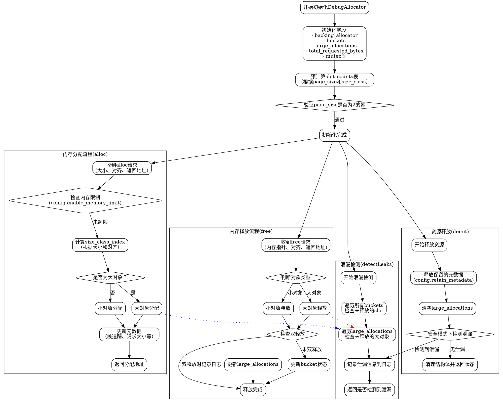

嗯，我需要帮用户画一个关于这个Zig函数`DebugAllocator`的流程图。首先，我得仔细看看代码的结构。这个函数返回一个结构体，里面有很多方法和字段，看起来是一个内存分配器的实现，用于调试。流程图可能需要展示这个结构体的主要组成部分以及它们之间的交互。

首先，结构体`DebugAllocator`包含了一些字段，比如`backing_allocator`、`buckets`、`large_allocations`等。这些字段应该作为流程图中的一部分。接下来，结构体内部定义了很多方法，比如`allocator`、`detectLeaks`、`deinit`，还有各种分配和释放内存的函数如`alloc`、`resize`、`free`等。

用户希望用Graphviz来画流程图，所以我需要确定各个模块之间的关系和数据流向。可能的步骤包括：

1. **初始化阶段**：当创建`DebugAllocator`时，初始化各个字段，比如设置默认的`backing_allocator`，初始化`buckets`数组等。
2. **内存分配流程**：当调用`alloc`方法时，根据请求的大小和内存类型（小对象或大对象）进行不同的处理。小对象可能分配到`buckets`中的某个bucket，大对象则存储在`large_allocations`中。
3. **内存释放流程**：释放内存时，同样需要判断是小对象还是大对象，更新对应的数据结构，比如标记bucket中的slot为未使用，或从`large_allocations`中移除。
4. **泄漏检测**：`detectLeaks`方法会遍历所有buckets和large_allocations，检查未释放的内存，并记录日志。
5. **资源释放**：在`deinit`时，释放所有保留的元数据，并检查是否有泄漏。

在画流程图时，可能需要分为几个子图，比如初始化、分配、释放、泄漏检测等部分。每个部分内部有具体的步骤，比如分配内存时，先检查内存限制，然后确定是使用bucket还是大对象存储，接着进行实际的内存分配，并记录相关信息。

需要注意的是，代码中有很多条件编译和配置选项，比如`config.safety`、`config.retain_metadata`等，这些可能会影响流程的分支。在流程图中可能需要用条件判断节点来表示这些分支。

另外，Graphviz使用DOT语言，需要定义各个节点和它们之间的连接。节点可以用矩形表示步骤，菱形表示条件判断，箭头表示流程方向。例如：

- 开始节点：初始化DebugAllocator
- 分配路径：
  - 检查内存限制
  - 判断是小对象还是大对象
  - 小对象：查找可用bucket，分配slot
  - 大对象：使用backing_allocator分配，记录到large_allocations
- 释放路径：
  - 判断是小对象还是大对象
  - 小对象：标记slot为未使用，更新bucket状态
  - 大对象：从large_allocations中移除或标记为已释放
- 泄漏检测：遍历所有数据结构，记录未释放的内存

可能还需要处理错误情况，比如双释放（double free）的检测和处理，这时候流程图中需要有相应的错误处理分支。

在具体实现时，可能需要将每个主要函数（如alloc, free, detectLeaks）作为子图，然后在主流程中连接它们。同时，结构体的字段和方法之间的关系也需要体现，比如`buckets`和`large_allocations`如何被各个方法操作。

最后，要确保流程图清晰，层次分明，不同部分之间有明确的连接，方便理解整个DebugAllocator的工作流程。
================================================

### 流程图说明：
1. **初始化阶段**：验证`page_size`合法性并初始化所有字段。
2. **内存分配**：
   - 优先检查内存限制，根据对象大小选择小对象bucket分配或大对象直接分配。
   - 记录栈追踪和元数据。
3. **内存释放**：
   - 区分小对象和大对象，更新对应数据结构。
   - 严格检测双释放问题。
4. **泄漏检测**：
   - 遍历所有bucket和large_allocations，记录未释放的内存。
5. **资源释放**：
   - 清理元数据和内存，最后进行泄漏检测并返回状态。

图形使用不同颜色和虚线的箭头表示跨模块的关联（如大对象分配/释放与泄漏检测的关系）。