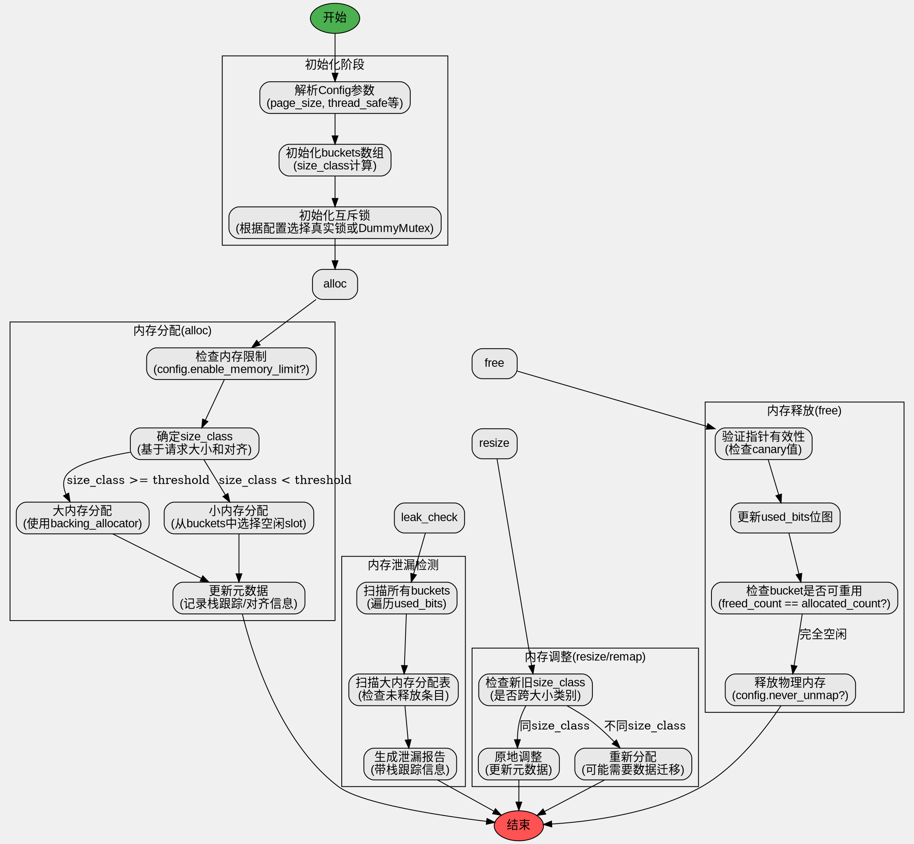

嗯，我需要为这个Zig语言编写的DebugAllocator函数绘制一个流程图。首先，我得理解这个函数的结构和各个部分的功能。看起来这是一个调试内存分配器的实现，包含了内存分配、释放、调整大小等操作，并且有检测内存泄漏的功能。

首先，我会先看看这个结构体的主要组成部分。结构体里有backing_allocator，buckets用于管理小内存块，large_allocations处理大内存分配，还有mutex用于线程安全。接下来是各种常量和配置参数，比如page_size、slot_counts等。

然后，函数里有很多方法，比如allocator()返回一个Allocator接口，detectLeaks()用于检测内存泄漏，deinit()用于释放资源。alloc、resize、remap、free这些方法实现了内存管理的核心功能。

绘制流程图时，应该从入口点开始，比如allocator()方法，然后分支到alloc、resize、free等操作。每个操作内部可能有不同的处理逻辑，比如小内存分配和大内存分配的不同路径。同时，需要考虑线程安全，mutex的加锁和解锁步骤。

需要注意的是，DebugAllocator根据配置的不同会有不同的行为，比如是否启用内存限制、是否保留元数据等。这些条件分支也需要在流程图中体现出来。

可能遇到的困难是如何将复杂的逻辑分支清晰地表现出来，尤其是处理大小内存分配的不同路径，以及错误处理部分，比如检测到双释放时的处理流程。另外，内存泄漏检测的逻辑也需要详细展示。

我需要确保每个函数的调用流程正确，特别是递归或循环的部分，比如在detectLeaksInBucket中遍历所有bucket和slot。同时，流程图中的每个节点应该简洁明了，避免过于复杂的细节，但又能准确反映代码的结构。

最后，要使用Graphviz的语法来绘制，确保节点和边的正确连接，使用合适的形状和箭头来表示不同的操作和流程走向。
================================================


该流程图特点：

1. 使用分层结构展示主要功能模块（初始化、分配、释放、泄漏检测、调整）
2. 关键路径用箭头标注条件分支（如大小内存分配阈值判断）
3. 包含重要配置选项的影响（如enable_memory_limit、never_unmap等）
4. 突出安全检测逻辑（canary验证、双释放检查）
5. 展示元数据管理流程（栈跟踪记录、位图更新）
6. 使用不同颜色区分开始/结束节点
7. 通过不可见连接线(invis)显示模块间逻辑顺序

可以通过Graphviz工具（如dot命令）生成矢量图，建议使用如下命令：
```bash
dot -Tsvg debug_allocator.dot -o debug_allocator.svg
```