好的，我需要分析用户提供的Zig代码，并为`MemoryPoolExtra`函数生成一个Graphviz的流程图。首先，我需要理解这段代码的结构和各个函数的作用。

首先，`MemoryPoolExtra`是一个返回结构体类型的泛型函数，接受`Item`类型和`pool_options`参数。结构体内部定义了与内存池相关的各种方法和属性，比如`init`、`deinit`、`preheat`、`reset`、`create`、`destroy`等。这些方法涉及到内存的分配、释放、预热和重置等操作。

接下来，我需要确定流程图的范围。用户希望的是整个`MemoryPoolExtra`函数的流程图，但可能更关注主要的方法和它们之间的调用关系。需要确定各个方法之间的流程，比如初始化、预热的步骤，创建和销毁对象的流程，以及重置内存池的过程。

可能的步骤包括：
1. 初始化内存池（`init`和`initPreheated`）。
2. 预热内存池（`preheat`），预先分配一定数量的内存块。
3. 创建对象（`create`），从空闲列表中获取或分配新内存。
4. 销毁对象（`destroy`），将内存块返回到空闲列表。
5. 重置内存池（`reset`），释放所有内存并重置状态。

需要注意各个方法之间的调用关系，例如`initPreheated`会调用`preheat`，而`create`可能会调用`allocNew`来分配新内存。同时，错误处理部分，如`errdefer`在`initPreheated`中的使用，也需要在流程图中体现。

另外，需要考虑结构体的成员变量，如`arena`和`free_list`，这些变量在流程中的变化，比如`free_list`在创建和销毁时的更新。

接下来，我需要将这些步骤和关系转化为Graphviz的节点和边。每个函数作为一个节点，函数之间的调用或流程顺序用边连接。例如，`initPreheated`调用`init`和`preheat`，`create`可能分支到从`free_list`获取或调用`allocNew`。

可能遇到的挑战是处理条件分支，比如在`create`方法中，如果`free_list`有空闲节点则使用，否则根据`growable`选项分配新内存或返回错误。这需要在流程图中用条件判断节点表示。

同时，需要确保节点和边的标签清晰，正确反映代码逻辑，比如使用菱形节点表示条件判断，矩形节点表示操作步骤。

最后，需要验证流程图的正确性，确保所有主要函数和关键逻辑路径都被覆盖，没有遗漏重要的步骤或错误处理分支。
================================================

```graphviz
digraph MemoryPoolExtra {
    rankdir=TB;
    node [shape=rectangle, style="rounded"];

    // Main Functions
    init [label="init(allocator)"];
    initPreheated [label="initPreheated(allocator, initial_size)"];
    preheat [label="preheat(size)"];
    create [label="create()"];
    destroy [label="destroy(ptr)"];
    reset [label="reset(mode)"];
    deinit [label="deinit()"];
    allocNew [label="allocNew()"];

    // Subroutines and Relationships
    init -> initPreheated [label="calls"];
    initPreheated -> preheat [label="calls (errdefer)"];
    initPreheated -> deinit [label="on error"];

    preheat -> allocNew [label="allocates memory"];
    preheat -> free_list [label="updates"];

    create -> free_list [label="checks if empty"];
    create -> allocNew [label="if growable=true"];
    create -> error_oom [label="else returns OutOfMemory"];
    create -> free_list [label="removes node"];

    destroy -> free_list [label="adds node back"];
    destroy -> ptr_undefined [label="resets item"];

    reset -> arena_reset [label="calls ArenaAllocator.reset()"];
    reset -> free_list [label="resets to null"];

    deinit -> arena_deinit [label="releases memory"];
    deinit -> pool_undefined [label="sets pool to undefined"];

    // Data Structures
    free_list [shape=ellipse, label="free_list"];
    arena [shape=ellipse, label="arena"];

    // Invisible edges for alignment
    {rank=same; init; initPreheated;}
    {rank=same; create; destroy;}
    {rank=same; preheat; reset;}
    {rank=same; free_list; arena;}
}
```

### 流程图说明：
1. **初始化流程**  
   - `init()` 创建基础内存池
   - `initPreheated()` 调用 `init()` 后执行 `preheat()` 预热内存
   - 初始化失败时通过 `errdefer` 调用 `deinit()`

2. **预热机制**  
   - `preheat()` 通过 `allocNew()` 分配内存块
   - 将新分配的内存块链接到 `free_list` 空闲列表

3. **对象生命周期**  
   - `create()` 优先从 `free_list` 获取空闲节点
   - 若空闲列表为空且支持扩容 (`growable=true`)，调用 `allocNew()` 分配新内存
   - 销毁对象时通过 `destroy()` 将内存块回收到 `free_list`

4. **内存管理**  
   - `reset()` 调用 ArenaAllocator 的底层重置逻辑
   - `deinit()` 彻底释放所有内存资源
   - `free_list` 作为核心数据结构，始终维护可用内存块的链表

5. **错误处理**  
   - 当 `growable=false` 且无空闲内存时，`create()` 返回 `OutOfMemory` 错误

该流程图通过节点间的箭头清晰地展示了内存池的初始化、分配、回收和销毁的全流程，以及关键数据结构（`free_list` 和 `arena`）的交互关系。