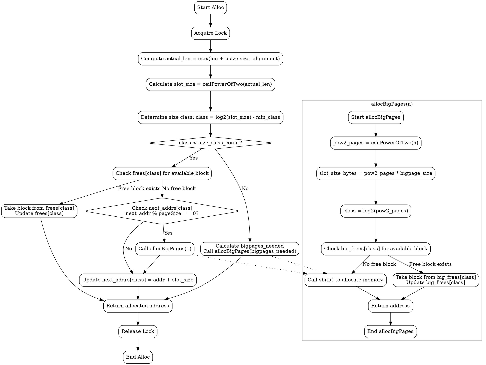

嗯，我需要为这个Zig代码中的SbrkAllocator函数画一个流程图。首先，我得仔细看看这个代码的结构和各个函数的作用。

首先，这个函数返回一个结构体，里面包含了vtable，定义了alloc、resize、remap、free等方法。还有一些常量和变量定义，比如size_class_count、big_size_class_count，以及next_addrs、frees、big_frees这些数组。这些看起来是用于内存管理的不同大小类的管理。

接下来是alloc函数，它处理内存分配。里面有一些锁的操作，确保线程安全。然后根据请求的大小计算实际的长度，找到对应的size class。如果有空闲块，就用空闲的；否则，可能需要分配新的内存页。这里还分为普通大小和大页（bigpage）的情况。

resize函数检查是否可以调整内存块的大小而不改变其所属的size class。remap函数则根据resize的结果决定是否返回原指针或null。free函数将内存块释放回对应的空闲链表，同样区分普通和大页。

allocBigPages函数用于分配大页，先检查是否有空闲的大页，没有的话调用sbrk来申请内存。

那么流程图应该从入口函数开始，比如alloc，然后根据不同的条件分支，比如是否有空闲块、是否需要分配新页、是否是bigpage等。每个函数的主要步骤需要分解成节点，条件判断作为分支。

需要注意的是，由于代码中有多个函数（alloc、resize、free等），可能需要为每个函数单独画流程图，或者将它们整合到一个大的流程中，显示它们之间的关系。但根据用户的问题，可能更关注整个SbrkAllocator的逻辑流程，特别是alloc的流程。

另外，代码中的锁管理、内存对齐、size class计算等步骤也需要在流程图中体现。例如，alloc中的锁获取和释放，计算实际长度，查找size class，处理空闲链表或分配新内存等步骤。

可能的结构是：

1. 开始alloc
2. 加锁
3. 计算actual_len和slot_size
4. 确定class
5. 如果class在普通size类中：
   a. 检查frees[class]是否有空闲块
   b. 有则取出，更新frees
   c. 否则检查next_addrs是否有可用空间，或者调用allocBigPages
6. 如果是大页：
   a. 计算需要的bigpages数量
   b. 调用allocBigPages分配
7. 返回地址，解锁

allocBigPages的流程：
1. 计算pow2_pages和slot_size_bytes
2. 检查big_frees是否有空闲块
3. 有则取出，更新big_frees
4. 否则调用sbrk分配

free的流程：
1. 加锁
2. 计算slot_size和class
3. 如果是普通class，将块加入frees链表
4. 否则加入big_frees链表
5. 解锁

resize和remap相对简单，主要是判断新旧size是否在同一类中。

现在需要将这些步骤用Graphviz的节点和边表示出来。可能需要分不同的子图，或者用不同的颜色区分不同的函数部分。但Graphviz主要是层级结构，可能需要按主要流程来组织。

可能的挑战是如何将条件判断和循环（比如检查空闲链表）简洁地表示出来，同时保持流程图的清晰。另外，代码中的一些复杂计算步骤可能需要简化，避免流程图过于繁琐。

总的来说，流程图应该包括主要的分支和处理步骤，每个关键函数的主要逻辑路径，以及它们之间的调用关系。比如alloc调用allocBigPages，free更新不同的空闲链表等。
================================================

该流程图分为两个主要部分：
1. **主分配流程（alloc函数）**：
   - 从获取锁开始，计算实际内存需求，确定大小类别
   - 根据是否是小内存块：
     - 检查空闲链表 → 使用现有块或分配新页
     - 大内存块直接调用allocBigPages

2. **大页分配子流程（allocBigPages函数）**：
   - 计算需要的大页数量
   - 优先使用大页空闲链表
   - 无可用块时调用sbrk系统调用

虚线箭头表示跨函数调用关系。菱形节点表示条件判断，圆角矩形表示操作步骤。