嗯，我需要用Graphviz来画这个Zig函数的流程图。首先，我得理解这个函数的结构。看起来这是一个HTTP头部解析器，处理不同的状态转换。函数feed接受一个HeadParser指针和一个字节切片，返回处理过的字节数。

首先，函数开始检查p.state的状态。状态有多个可能的值：finished, start, seen_n, seen_r, seen_rn, seen_rnr。每个状态对应不同的处理逻辑。

比如，当状态是start时，根据剩余的字节数（0、1、2、3、4到vector_len-1，或者其他情况）进行不同的处理。每个分支可能改变状态，并更新index的值。

接下来，我需要把这些逻辑分支转化为流程图。每个状态作为节点，不同的条件分支作为边。需要注意的是循环结构，比如while (true)循环，以及各个case中的continue和return语句。

可能需要先画出各个状态之间的转换关系。例如，当在start状态下处理不同的字节长度时，会进入不同的子条件，并可能改变状态到seen_r、seen_n、seen_rn等，或者直接返回。

另外，处理过程中使用了SIMD优化，但流程图主要关注控制流，而不是具体实现细节。需要忽略变量定义和计算，专注于状态转移和条件判断。

需要注意的是，每个switch语句中的不同case对应不同的路径，比如在start状态下，根据bytes.len - index的值进入不同的处理块。每个处理块可能改变状态，并返回或继续循环。

可能的结构是，从函数入口开始，进入主循环，根据当前状态跳转到对应的处理块。每个处理块内部根据条件改变状态，并更新index，然后继续循环或返回。

对于每个状态，比如seen_r或seen_rn，同样需要处理不同的剩余字节数，并可能改变状态或结束解析。

需要确保所有可能的路径都被覆盖，包括各种边界条件，比如剩余字节数不足时的处理。

最后，将所有这些状态和转换用Graphviz的节点和边表示出来，可能需要使用子图来组织不同状态的处理逻辑，使流程图清晰易读。
================================================

```dot
digraph HeadParserFlow {
    node [shape=rectangle, style=rounded];

    start [label="开始"];
    finished [label="返回 index"];
    process_state [label="处理当前状态"];
    check_state [label="检查 p.state"];
    state_start [label="状态: start"];
    state_seen_n [label="状态: seen_n"];
    state_seen_r [label="状态: seen_r"];
    state_seen_rn [label="状态: seen_rn"];
    state_seen_rnr [label="状态: seen_rnr"];
    handle_bytes_0 [label="bytes.len - index == 0?\l返回 index"];
    handle_bytes_1 [label="bytes.len - index == 1?\l检查字符并更新状态\l返回 index+1"];
    handle_bytes_2 [label="bytes.len - index == 2?\l检查双字符组合并更新状态\l返回 index+2"];
    handle_bytes_3 [label="bytes.len - index == 3?\l检查三字符组合并更新状态\l返回 index+3"];
    handle_bytes_4_to_vector [label="bytes.len - index >=4 && < vector_len?\l检查四字符组合并更新状态\lindex +=4\l继续循环"];
    handle_vector_chunk [label="处理 vector_len 字节块\l根据匹配数更新状态\lindex += vector_len\l继续循环"];
    handle_seen_n [label="处理 seen_n 状态\l检查下一个字符并更新状态\lindex +=1\l继续循环"];
    handle_seen_r [label="处理 seen_r 状态\l根据剩余字节数更新状态\l返回或继续循环"];
    handle_seen_rn [label="处理 seen_rn 状态\l检查后续字符并更新状态\lindex +=2\l继续循环"];
    handle_seen_rnr [label="处理 seen_rnr 状态\l检查下一个字符并更新状态\lindex +=1\l继续循环"];

    start -> check_state;
    check_state -> state_start [label="p.state == start"];
    check_state -> state_seen_n [label="p.state == seen_n"];
    check_state -> state_seen_r [label="p.state == seen_r"];
    check_state -> state_seen_rn [label="p.state == seen_rn"];
    check_state -> state_seen_rnr [label="p.state == seen_rnr"];
    check_state -> finished [label="p.state == finished"];

    state_start -> handle_bytes_0 [label="剩余0字节"];
    state_start -> handle_bytes_1 [label="剩余1字节"];
    state_start -> handle_bytes_2 [label="剩余2字节"];
    state_start -> handle_bytes_3 [label="剩余3字节"];
    state_start -> handle_bytes_4_to_vector [label="剩余4~vector_len-1字节"];
    state_start -> handle_vector_chunk [label="剩余>=vector_len字节"];

    handle_bytes_0 -> finished;
    handle_bytes_1 -> finished;
    handle_bytes_2 -> finished;
    handle_bytes_3 -> finished;
    handle_bytes_4_to_vector -> process_state;
    handle_vector_chunk -> process_state;

    state_seen_n -> handle_seen_n;
    handle_seen_n -> check_state;

    state_seen_r -> handle_seen_r;
    handle_seen_r -> check_state [label="处理完成"];

    state_seen_rn -> handle_seen_rn;
    handle_seen_rn -> check_state;

    state_seen_rnr -> handle_seen_rnr;
    handle_seen_rnr -> check_state;

    process_state -> check_state [label="继续循环"];
}
```
