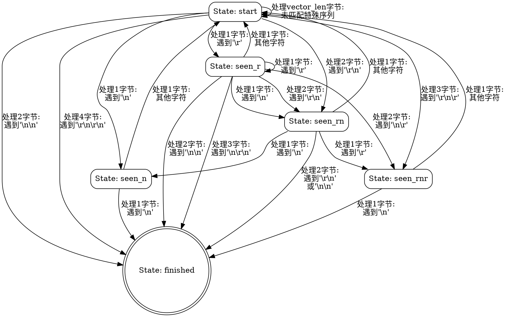

嗯，我现在需要帮用户用Graphviz画出这个Zig函数的流程图。首先，我得理解这个函数是做什么的。看起来这是一个HTTP头部解析器的feed函数，处理字节流并根据不同的状态转换来解析头部。函数里有一个状态机，不同的状态对应不同的处理逻辑。

首先，我需要理清函数的结构。函数的主循环是一个while(true)，根据当前的状态（p.state）进入不同的分支处理。每个状态分支处理不同长度的字节，可能会有状态转换，然后返回处理过的字节数或者继续处理。

接下来，我需要确定各个状态之间的转换关系。状态包括.start, .seen_r, .seen_n, .seen_rn, .seen_rnr, .finished。每个状态下，根据输入的字节内容，会转移到不同的状态或者结束。

比如，在.start状态下，处理不同长度的字节（0、1、2、3、4到vector_len-1，以及更大的块）。每个长度分支里可能会改变状态，并返回相应的index。例如，处理1个字节时，如果是\r或\n，状态变为.seen_r或.seen_n，然后返回index+1。

然后，其他状态如.seen_n、.seen_r等，处理后续的字节，可能继续改变状态或结束。

接下来，我需要将这些状态和转换用流程图表示出来。Graphviz的流程图通常由节点和边组成，节点表示状态，边表示转换条件和动作。

可能的步骤：
1. 确定所有状态节点。
2. 对于每个状态，分析可能的转换路径。
3. 将每个状态内的处理分支转换为边，标注条件和操作（如处理字节数、状态变化）。
4. 处理循环和继续处理的情况，可能需要回到循环开始或进入其他状态。

需要注意的是，这个函数的结构比较复杂，尤其是.start状态下处理不同字节长度的多个分支，每个分支内部可能有不同的转换。此外，使用SIMD向量处理的部分也需要考虑，但可能在流程图中简化为一个处理块。

在绘制时，可能需要将每个状态作为节点，然后每个可能的转换条件作为边的标签。例如，从.start状态到.seen_r的条件是处理到'\r'字节，同时返回index+1。同时，处理不同字节长度可能导致不同的转换路径。

此外，函数中有多个返回点，需要确定这些返回如何影响流程。例如，在某个分支处理完直接返回index，否则继续循环。

可能遇到的困难是如何简洁地表示复杂的条件分支，尤其是处理不同字节长度时的多个情况。可能需要将一些分支合并或用注释说明，避免流程图过于复杂。

现在，我需要将这些逻辑转化为Graphviz的DOT语言。每个状态作为节点，转换条件作为边。同时，需要考虑循环的结构，比如处理完一部分字节后继续循环处理剩余的部分。

最终，流程图应展示状态之间的转换，每个转换的条件（如遇到的字节值或序列），以及可能的处理步骤（如增加index的值）。可能还需要标注处理字节数的不同情况，例如处理1、2、3或更多字节时的不同逻辑。
================================================

该流程图展示了以下关键逻辑：

1. 状态节点使用圆角矩形表示，终态finished使用双圆环
2. 状态转移条件标注在边上的标签中：
   - 包含处理的字节数和匹配的特殊字符序列
   - 如"处理2字节:\n遇到'\\r\\n'"表示处理2字节时匹配到CRLF
3. 主要处理路径：
   - start状态处理不同长度的字节序列
   - 各中间状态（seen_*）处理后续可能的字符组合
   - 最终通过匹配CRLFCRLF或其他终止序列到达finished状态
4. 特殊处理：
   - vector_len块处理未匹配时保持start状态
   - 未标注的默认情况返回start状态
   - 带索引跳转的循环逻辑通过状态自环表示

该图简化了以下实现细节：
- 具体索引计算逻辑
- SIMD向量处理细节
- 边界条件检查
- 错误处理路径
保留了核心状态转换逻辑和关键字符序列匹配条件。