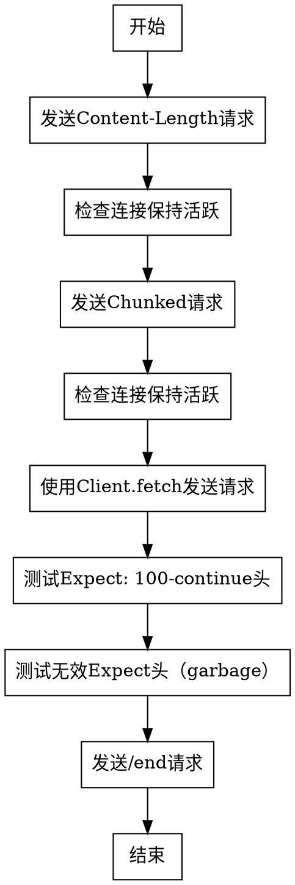

好的，我需要为提供的Zig函数`echoTests`生成一个流程图。首先，我需要仔细阅读代码，理解每个部分的功能和逻辑流程。

函数`echoTests`看起来是一个测试函数，用于向HTTP服务器发送不同类型的请求，并验证响应是否符合预期。代码中有多个块，每个块执行不同的测试用例：

1. **发送带有Content-Length的请求**：构造一个POST请求，设置内容长度为14，发送数据，并验证返回的body是否正确。
2. **检查连接是否保持活跃**：验证连接池中是否有空闲连接。
3. **发送分块传输编码（chunked）的请求**：类似第一个测试，但使用分块传输。
4. **再次检查连接是否保持活跃**。
5. **使用Client.fetch方法发送请求**：使用不同的API发送请求，并验证响应。
6. **测试Expect: 100-continue头**：发送带有该头的请求，验证服务器是否正确处理。
7. **测试无效的Expect头（garbage）**：预期服务器返回417 Expectation Failed。
8. **最后发送一个请求到/end端点**。

接下来，我需要将这些步骤转化为流程图。流程图应包含开始、结束节点，以及各个测试用例块之间的流程。需要注意条件判断，例如连接是否保持活跃的检查，可能需要分支。但根据代码中的`try expect(...)`，这些检查是断言，如果失败则测试会终止，因此在流程图中可以表示为顺序步骤，而不需要条件分支。

可能的流程图结构如下：

- 开始
- 发送Content-Length请求
- 检查连接保持
- 发送Chunked请求
- 检查连接保持
- 使用Client.fetch发送请求
- 测试Expect: 100-continue
- 测试无效Expect头
- 发送/end请求
- 结束

每个步骤之间用箭头连接，表示顺序执行。由于代码中没有循环或复杂分支，流程图相对线性。需要注意的是，某些步骤内部可能有错误处理，但Zig的`try`关键字会将错误向上传播，导致函数提前返回，这在流程图中可以统一处理为异常终止路径，但用户可能希望专注于主流程。

最后，使用Graphviz的DOT语言来绘制流程图，确保节点和边正确表示代码的执行顺序。
================================================
