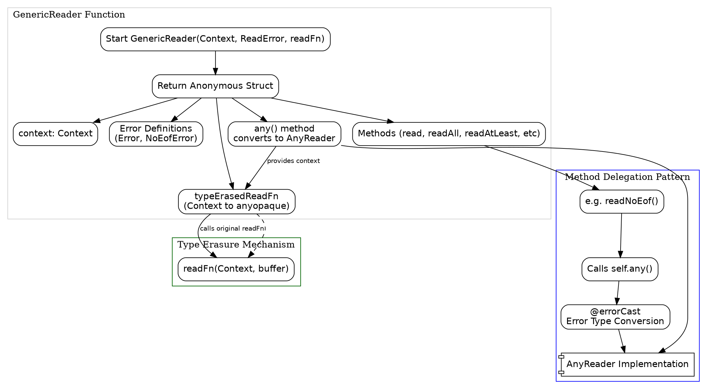

嗯，用户让我用Graphviz来画这个Zig函数的流程图。首先，我需要理解这个函数的代码结构。这个函数叫做`GenericReader`，看起来是一个泛型读取器的实现。它接受几个参数：`Context`类型、`ReadError`类型和一个`readFn`函数，返回一个结构体类型。

接下来，结构体内部有很多方法，比如`read`、`readAll`、`readAtLeast`等等。每个方法似乎都调用了`self.any()`的相应方法，并通过`@errorCast`进行错误转换。还有`any()`方法返回一个`AnyReader`类型，可能是一个类型擦除的读取器。此外，有一个`typeErasedReadFn`函数，将上下文转换为泛型上下文并调用`readFn`。

我需要确定如何将这些方法组织成流程图。可能需要从`GenericReader`函数开始，展示如何根据输入参数生成结构体。然后，结构体的各个方法如何调用`any()`方法，进而调用类型擦除后的函数。可能还需要显示`typeErasedReadFn`如何处理上下文和调用`readFn`。

需要注意的是，有些方法是内联的（`inline fn`），这在流程图中是否需要特别标注？可能不需要，因为流程图更关注逻辑流程而非性能优化。另外，错误处理部分有很多错误联合类型，但流程图可能不需要详细展示每个错误类型，而是整体错误传递的路径。

用户可能希望看到主函数如何构造读取器结构体，各个方法如何与`AnyReader`交互，以及类型擦除的过程。同时，`typeErasedReadFn`作为内部函数如何桥接泛型上下文和类型擦除的上下文也是一个关键点。

接下来，我需要将这些步骤转化为Graphviz的节点和边。可能的节点包括函数入口、结构体定义、各个方法、`any()`方法、`typeErasedReadFn`，以及`AnyReader`的使用。边表示调用关系或数据流向。

需要注意避免图表过于复杂，可能需要分层展示，比如将结构体的方法分组，显示它们如何委托给`AnyReader`。同时，类型擦除的部分需要清晰展示`context`的转换过程。

最后，检查是否涵盖了所有重要部分，确保流程图准确反映了代码的结构和数据流向。
================================================

这个流程图展示了：

1. **主结构**：GenericReader函数生成包含上下文、错误定义和方法的匿名结构体
2. **方法委托模式**：所有方法通过any()方法委托给AnyReader实现，并进行错误类型转换
3. **类型擦除机制**：通过typeErasedReadFn实现泛型上下文到anyopaque的类型擦除
4. **核心交互**：展示了方法调用如何最终路由到原始readFn的实现

关键特征：
- 使用不同颜色的子图区分逻辑模块
- 展示了泛型参数到具体实现的转换过程
- 体现了类型擦除的核心机制
- 显示了方法调用的委托链
- 使用不同箭头样式区分直接调用和数据转换