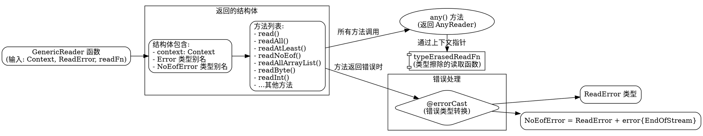

好的，我需要为这个Zig语言编写的`GenericReader`函数生成一个Graphviz的流程图。首先，我得仔细理解这段代码的结构和各个部分之间的关系。

首先，这个`GenericReader`函数接受几个参数：`Context`类型、`ReadError`类型、以及一个`readFn`函数。它返回一个结构体类型。这个结构体包含一个`context`字段和多个方法，比如`read`、`readAll`、`readAtLeast`等。每个方法似乎都是通过调用`any()`方法将具体实现委托给另一个类型`AnyReader`，然后进行错误类型的转换。

接下来，我需要确定流程图的节点和连接。流程图应该从`GenericReader`函数开始，然后展示返回的结构体及其方法。每个方法可能会有调用关系，比如`readAll`调用`any().readAll`，`readNoEof`调用`any().readNoEof`等。此外，结构体中的`any()`方法返回`AnyReader`，而`typeErasedReadFn`是内部使用的函数，用于类型擦除的读取操作。

需要注意不要遗漏任何公共方法，比如`readByte`、`readInt`、`readStruct`等，每个方法都需要在流程图中体现。同时，错误类型的处理也是一个重要部分，比如`NoEofError`和`ReadError`的组合。

可能的结构是将`GenericReader`作为入口点，分支出结构体的各个方法，每个方法指向其调用的`any()`方法对应的函数，并显示错误类型的转换。此外，`typeErasedReadFn`作为辅助函数，也应该出现在流程图中，显示它如何被`any()`方法调用。

需要确保节点之间的箭头正确表示调用关系，同时用注释或标签说明错误类型的转换和使用`@errorCast`的地方。还要注意避免循环引用，保持流程图的清晰和层次结构。

最后，根据Graphviz的语法，定义各个节点和它们之间的关系，使用合适的形状（如矩形表示函数，菱形表示判断等），并合理排列节点位置，使流程图易于理解。
================================================
