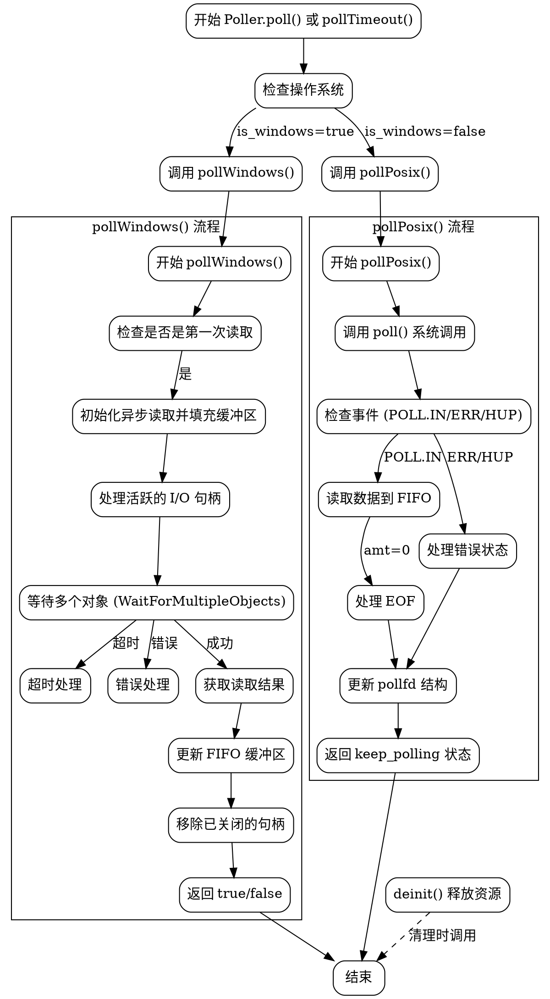

好的，我需要为提供的Zig代码中的Poller函数绘制一个流程图。首先，我得理解这段代码的结构和逻辑。

代码定义了一个Poller结构体，根据不同的操作系统（Windows或POSIX）有不同的实现。主要函数包括poll、pollTimeout、deinit等。其中pollWindows和pollPosix是处理不同系统下轮询逻辑的内部函数。

首先，我应该确定流程图的入口点。可能是poll和pollTimeout这两个公共方法，它们分别调用pollWindows或pollPosix。接下来，这两个内部函数各自的逻辑需要分解。

对于pollWindows函数，主要步骤包括检查是否是第一次读取，处理异步I/O，等待多个对象，处理读取结果，更新缓冲区等。而pollPosix则使用POSIX的poll系统调用，处理文件描述符的事件，读取数据并更新缓冲区。

需要注意的是条件判断，如操作系统的判断（is_windows），循环处理，错误处理等。这些都需要在流程图中体现出来。

此外，deinit函数负责资源的释放，也需要在流程图中有所表示，可能作为退出或清理步骤。

在绘制时，应该使用不同的节点表示函数调用、条件判断、循环、错误处理等。连线要清晰展示程序的执行路径，包括正常流程和异常处理。

最后，需要确保流程图的结构清晰，层次分明，方便理解代码的执行流程。
================================================
