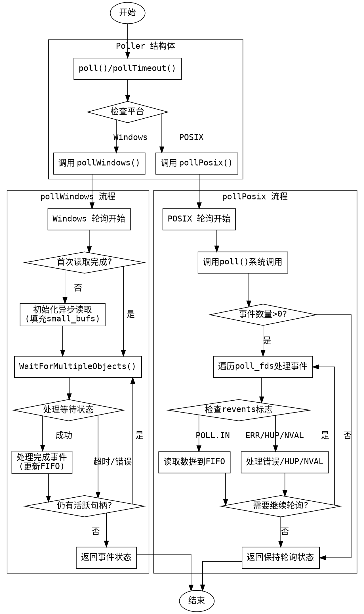

好的，我现在需要帮用户用Graphviz画出他们提供的Zig代码中的`Poller`函数的流程图。首先，我需要理解这段代码的结构和逻辑。

首先，我看到这是一个泛型结构体`Poller`，它接受一个`StreamEnum`类型参数。结构体内部有多个字段，包括`fifos`、`poll_fds`和根据平台条件编译的`windows`结构。看起来这个结构体主要是用于处理不同平台下的异步I/O轮询。

接下来，结构体有`deinit`方法用于释放资源，`poll`和`pollTimeout`方法用于轮询事件，还有`fifo`方法获取对应的FIFO队列。然后，针对Windows和POSIX平台，分别有`pollWindows`和`pollPosix`两个私有方法。

对于流程图，我需要分解每个主要函数的执行流程。比如`poll`方法会根据平台调用不同的实现。在Windows部分，`pollWindows`处理异步I/O，包括初始化读取、等待事件、处理完成事件等。POSIX部分使用传统的`poll`系统调用，检查文件描述符的状态，处理读写事件和错误。

我需要考虑如何将每个函数的逻辑步骤转化为流程图中的节点和分支。例如，`pollWindows`中的循环处理等待多个对象，根据不同的状态处理事件；而`pollPosix`中检查`poll_fds`的事件标志，处理读写和错误情况。

同时，需要注意条件判断和循环结构，如`while (true)`循环，以及错误处理和返回路径。每个条件分支需要用菱形节点表示，处理不同的情况，如超时、错误、数据可读等。

可能还需要区分不同平台的处理逻辑，在流程图中标明Windows和POSIX的不同路径。此外，函数之间的调用关系也需要体现，比如`poll`调用`pollWindows`或`pollPosix`，而它们内部又有其他函数调用。

需要确保流程图的节点清晰，步骤有序，避免过于复杂。可能需要将大函数分解为多个子流程，尤其是`pollWindows`和`pollPosix`这两个较长的函数。同时，注意错误处理和资源释放的步骤，如`deinit`方法中的取消I/O操作和释放资源。

最后，使用Graphviz的语法将各个节点和边连接起来，合理排列布局，确保流程图的可读性。可能需要使用子图来区分不同平台的处理部分，或者用颜色标记不同的逻辑分支。
================================================

这个流程图主要包含以下特点：

1. **平台分支**：用中央的 platform_check 节点区分 Windows 和 POSIX 的不同实现路径

2. **Windows子流程**：
   - 包含异步IO初始化
   - 使用 WaitForMultipleObjects 等待事件
   - 处理完成端口事件
   - 动态管理活跃句柄列表

3. **POSIX子流程**：
   - 传统 poll() 系统调用
   - 遍历处理每个文件描述符
   - 处理不同的事件标志（POLLIN/ERR等）

4. **关键决策点**使用菱形节点表示：
   - 平台判断
   - 首次读取检查
   - 事件等待状态
   - 是否继续轮询

5. **错误处理**路径：
   - Windows 的错误状态通过 GetLastError 处理
   - POSIX 的错误标志（ERR/HUP/NVAL）特殊处理

6. **数据流动**：
   - 用箭头方向表示执行流
   - 标注关键的系统调用（WaitForMultipleObjects/poll）
   - 显示缓冲区操作（small_bufs/FIFO更新）

可以通过 Graphviz 工具（如VSCode的Graphviz插件）渲染这个.dot文件，生成清晰的层级化流程图。