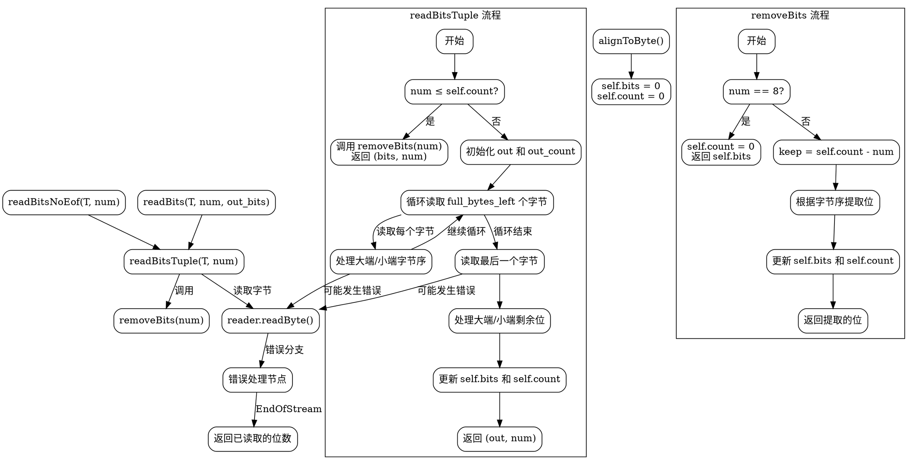

嗯，我现在要分析这个用Zig编写的BitReader结构体的代码，并为它生成一个Graphviz的流程图。首先，我需要理解这段代码的主要功能和各个方法之间的调用关系。BitReader的作用是按位读取数据，支持不同的字节序（endian）。结构体内部有reader、bits和count三个成员变量，分别表示底层的读取器、当前的位缓冲和剩余的位数。

首先，我需要理清各个方法的用途。例如，readBitsNoEof、readBits、readBitsTuple这三个公共方法都是用来读取指定位数的数据，但处理EOF的方式不同。readBitsTuple是最基础的方法，其他两个方法可能基于它实现。而removeBits和alignToByte是内部辅助方法，用于管理位缓冲。

接下来，我需要考虑流程图的结构。通常，流程图会从入口点开始，比如调用readBitsNoEof，然后根据逻辑分支展示不同的处理路径。例如，在readBitsTuple中，会先检查是否有足够的缓冲位，然后处理完整字节，再处理剩余的位。同时，需要考虑不同的字节序处理（大端和小端）带来的分支。

还要注意错误处理的情况，比如在读取字节时可能遇到EndOfStream错误，这时候需要返回已读取的位数。此外，缓冲区的管理逻辑，如removeBits如何调整bits和count的值，也需要在流程图中体现。

可能需要为每个主要方法绘制子流程图，然后通过调用关系将它们连接起来。例如，readBitsTuple调用removeBits和reader.readByte()，而readBits和readBitsNoEof又调用readBitsTuple。同时，alignToByte方法相对独立，直接重置缓冲区的bits和count。

在绘制流程图时，节点应表示操作或判断，边表示流程的走向。例如，判断“num <= self.count”会导致不同的处理路径：直接从缓冲区取位，或者继续读取更多字节。对于循环结构，如读取full_bytes_left次数的循环，需要用循环节点表示。

需要注意的是，Graphviz使用DOT语言，所以要正确使用节点和边的语法，合理分组和排列节点，确保流程图的可读性。可能需要使用子图来组织不同方法的内部逻辑，或者用颜色区分不同的处理分支（比如大端和小端的不同处理）。

最后，要确保流程图的准确性和完整性，涵盖所有主要逻辑路径，包括错误处理和边缘情况，如读取不足指定位数时的处理，以及缓冲区管理中的各种情况。
================================================

这个流程图包含以下特点：
1. 使用子图分别展示核心方法 `readBitsTuple` 和 `removeBits` 的内部逻辑
2. 展示了字节序处理（大端/小端）的分支
3. 包含错误处理路径（EndOfStream）
4. 用虚线框表示外部依赖（reader.readByte()）
5. 显示了主要方法之间的调用关系
6. 使用颜色区分不同逻辑模块（需要在支持颜色的渲染器中查看）