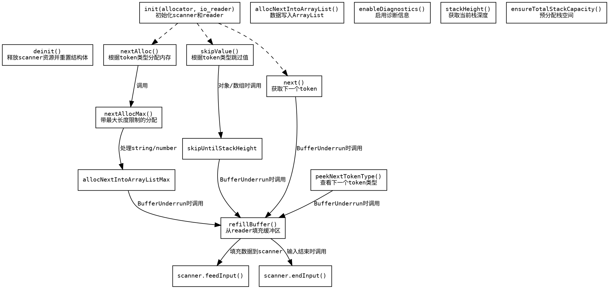

嗯，我现在需要为这个Zig语言编写的JSON扫描器函数生成一个流程图。首先，我需要理解这段代码的结构和各个函数的作用。这个Reader函数返回一个结构体，里面包含了一些方法，比如init、deinit、next、peekNextTokenType等。每个方法都有不同的逻辑，比如处理缓冲区、分配内存、跳过值等。

首先，我应该确定流程图的起点。可能从Reader的初始化开始，然后根据不同的方法调用分支。比如，当调用nextAlloc时，会检查token类型，根据不同的类型处理数字或字符串，可能涉及到内存分配。如果遇到缓冲区不足的情况，会调用refillBuffer来补充数据。

接下来，我需要考虑各个方法之间的调用关系。例如，next方法在遇到BufferUnderrun错误时会调用refillBuffer，而refillBuffer又会从reader读取数据到buffer，并通知scanner。这些循环和错误处理需要体现在流程图中。

同时，像skipValue方法需要根据当前的token类型来决定是跳过对象、数组还是基本类型。这可能需要多个判断分支，比如检查是否是对象开始或数组开始，然后递归跳过直到栈高度恢复。

另外，像allocNextIntoArrayListMax方法会循环处理，直到数据足够或者出现错误。这里需要处理BufferUnderrun错误，并重新填充缓冲区，继续尝试。

需要注意的是，流程图应该清晰地展示各个函数的执行流程，包括条件判断、循环、错误处理以及函数之间的调用关系。可能需要为每个主要方法绘制子流程图，或者将整个Reader结构体的主要流程整合到一个大图中，显示各个方法如何协同工作。

另外，要确保不使用Mermaid语法，而是使用Graphviz的DOT语言来描述流程图。这需要定义节点、边，以及各个节点之间的逻辑关系。例如，初始化之后可能有多个可能的路径，比如调用next、skipValue等，每个方法内部又有自己的处理步骤。

可能遇到的挑战是如何简洁地表示循环和错误处理，尤其是像refillBuffer这种在多个地方被调用的函数。需要确保这些公共部分在流程图中得到适当的复用表示，避免重复节点。

最后，检查是否有遗漏的重要步骤，比如deinit方法释放资源，或者enableDiagnostics设置诊断信息等，这些可能在流程图中作为次要节点出现，或者根据需求决定是否包含。

总结来说，我需要将每个主要方法的逻辑分解成步骤，用Graphviz的节点和边连接起来，处理条件分支和循环，确保错误处理路径清晰，并且整体结构易于理解。
================================================

这个流程图使用Graphviz的DOT语言绘制，主要特点：

1. 展示了初始化/销毁等生命周期方法
2. 用虚线连接初始化到核心方法表示调用入口
3. 突出了BufferUnderrun错误处理的核心路径
4. 展示了skipValue和nextAlloc两种主要操作的分支逻辑
5. 将公共的refillBuffer操作独立为一个节点
6. 标注了关键的方法调用关系和错误处理路径
7. 保持了Zig代码中重要的方法命名和错误处理语义

可以通过Graphviz工具（如dot命令）生成PNG/SVG等格式的可视化流程图。节点颜色和样式可以根据需要进一步调整以增强可读性。