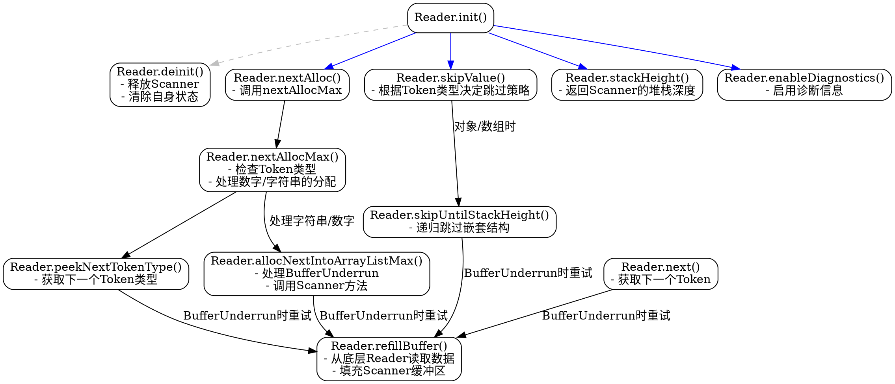

嗯，我需要为这个Zig函数生成一个流程图。首先，我得仔细阅读代码，理解每个函数的作用和它们之间的调用关系。这个文件定义了一个Reader结构体，它包含了一个Scanner和一个ReaderType，还有一些方法，比如init、deinit、next、skipValue等等。

首先，流程图应该从Reader的初始化开始，也就是init函数。然后可能涉及到读取数据，比如next、peekNextTokenType这些方法。每个方法内部可能有循环或条件判断，比如在next方法中，处理BufferUnderrun错误时会调用refillBuffer，然后继续循环。

接下来，我需要考虑各个函数之间的流程。例如，当调用nextAlloc时，它会调用peekNextTokenType来确定下一个token的类型，然后根据不同的类型进行不同的处理，比如处理数字或字符串时可能需要分配内存，或者直接返回简单token。

在处理错误的时候，比如BufferUnderrun，流程会跳转到refillBuffer函数，这个函数会从reader中读取数据到buffer，并feed给scanner。这部分也需要在流程图中体现出来。

另外，skipValue函数会根据当前的token类型决定是跳过整个对象/数组，还是简单的值，这涉及到递归或循环结构。

可能还需要考虑各个公共方法如enableDiagnostics、stackHeight等，这些可能比较简单，直接调用scanner的对应方法。

在绘制流程图时，需要将每个函数作为一个节点，函数之间的调用关系用箭头连接，条件判断用菱形框表示，循环结构用箭头回指。同时，错误处理路径也需要标注出来，比如遇到BufferUnderrun时的处理流程。

需要注意的是，有些函数可能会互相调用，比如next和peekNextTokenType都可能调用refillBuffer，这可能导致流程图的复杂性。需要合理组织节点，避免交叉过多，保持清晰。

最后，确认每个函数的返回和错误处理是否正确表示，确保流程图的准确性。
================================================
