嗯，我需要根据提供的Zig代码中的innerParse函数来生成一个流程图。首先，我得理解这个函数的结构和逻辑流程。这个函数是一个递归的解析函数，根据不同的类型进行不同的处理。

首先，函数接收一个类型T、分配器、数据源和解析选项。然后，它根据T的类型信息进行不同的处理。例如，如果是布尔类型，它会检查下一个token是true还是false；如果是数值类型，会解析字符串为整数或浮点数；对于可选类型，会检查是否为null；枚举、联合、结构体、数组、指针等类型都有各自的处理逻辑。

接下来，我需要将这些逻辑分支转化为流程图。流程图的开始是函数入口，然后根据不同的类型分支到不同的处理块。每个处理块内部可能有进一步的判断和操作，例如解析token、递归调用innerParse、处理错误等。

需要注意的是递归调用的情况，比如在处理结构体或联合时，可能会再次调用innerParse来解析子字段。此外，错误处理也是一个重要部分，每个分支都可能返回错误，需要在流程图中体现可能的错误路径。

另外，代码中有很多条件判断，比如使用switch语句根据类型信息分派到不同的处理逻辑。这些条件判断需要转化为流程图中的判断节点，每个分支对应不同的处理流程。

最后，要确保流程图的逻辑清晰，每个节点和分支都正确反映代码的结构，避免遗漏重要的处理步骤或错误情况。可能需要多次检查代码，确认每个case都被正确转换到流程图中。
================================================

```graphviz
digraph innerParseFlowchart {
    graph [bgcolor=transparent];
    node [fontname="Arial", shape=box, style="rounded,filled", fillcolor="#E5E5E5", color="#333333", fontcolor="#333333"];
    edge [color="#666666", fontname="Arial", fontsize=10];

    start [label="Start innerParse(T, allocator, source, options)", shape=ellipse];
    end [label="Return parsed value", shape=ellipse];
    error [label="Return Error", shape=ellipse];

    start -> typeSwitch;
    
    subgraph cluster_typeSwitch {
        label="Switch @typeInfo(T)";
        typeSwitch [label="", shape=point, width=0];
        
        typeSwitch -> bool [label=".bool"];
        typeSwitch -> number [label=".float/.comptime_float"];
        typeSwitch -> integer [label=".int/.comptime_int"];
        typeSwitch -> optional [label=".optional"];
        typeSwitch -> enum [label=".enum"];
        typeSwitch -> union [label=".union"];
        typeSwitch -> struct [label=".struct"];
        typeSwitch -> array [label=".array"];
        typeSwitch -> vector [label=".vector"];
        typeSwitch -> pointer [label=".pointer"];
    }

    // Bool handling
    bool [label="Check next token"];
    bool -> bool_true [label=".true"];
    bool -> bool_false [label=".false"];
    bool -> error [label="else"];
    bool_true [label="Return true"];
    bool_false [label="Return false"];
    bool_true -> end;
    bool_false -> end;

    // Number handling
    number [label="Get token\nParse to float"];
    number -> error [label="Unexpected token"];
    number -> end;

    // Integer handling
    integer [label="Get token\nConvert to int"];
    integer -> error [label="Unexpected token"];
    integer -> end;

    // Optional handling
    optional [label="Peek next token"];
    optional -> optional_null [label=".null"];
    optional -> optional_recurse [label="else"];
    optional_null [label="Return null"];
    optional_recurse [label="Recurse into child type"];
    optional_null -> end;
    optional_recurse -> end;

    // Enum handling
    enum [label="Check custom jsonParse\nElse parse enum from token"];
    enum -> error [label="Unexpected token"];
    enum -> end;

    // Union handling
    union [label="Check object_begin\nParse tagged union"];
    union -> error [label="Invalid structure"];
    union -> end;

    // Struct handling
    struct [label="Check tuple/object\nParse fields"];
    struct -> error [label="Invalid structure"];
    struct -> end;

    // Array handling
    array [label="Parse array/string"];
    array -> error [label="Unexpected token"];
    array -> end;

    // Vector handling
    vector [label="Parse array"];
    vector -> error [label="Unexpected token"];
    vector -> end;

    // Pointer handling
    pointer [label="Handle slice/allocations"];
    pointer -> error [label="Unsupported pointer"];
    pointer -> end;

    error -> end [style=invis];
}
```
