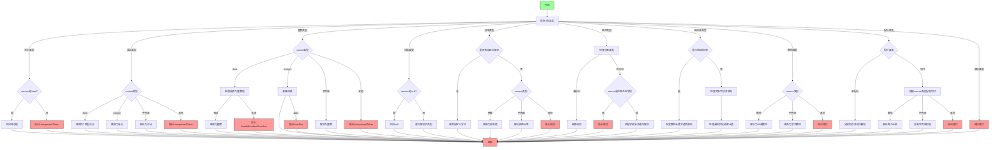

嗯，我需要为这个Zig函数画一个流程图。首先，我得仔细看看这个函数的结构。函数名是innerParseFromValue，看起来是一个递归解析JSON值的函数。它处理不同类型的T，根据不同的类型进行不同的处理。

首先，函数开始会检查T的类型信息，使用@typeInfo(T)。然后根据不同的类型分支处理，比如.bool、.float、.int，还有结构体、联合体、数组、指针等等。每个分支里又有不同的情况，比如对于布尔类型，直接返回对应的布尔值；对于整数或浮点数，处理不同的source类型，比如.float、.integer或者字符串形式的数字。

对于结构体，需要检查是否是元组结构体，如果是的话处理数组形式的输入，否则处理对象形式，逐个字段解析，并处理未知字段的情况。联合体需要处理标签类型，检查字段名是否匹配，递归解析对应的值。指针类型则分为单个指针和切片，处理分配内存和解析元素。

我需要把这些逻辑分支用流程图的形式表现出来。可能从函数入口开始，然后根据不同的类型分支，每个分支内部的条件判断和返回。比如，当类型是bool时，检查source是否是bool类型，是的话返回，否则报错。对于结构体，如果是元组，检查数组长度是否匹配，然后逐个解析字段；否则处理对象的各个字段，处理默认值等。

需要注意的是，递归调用的情况，比如解析结构体字段时可能再次调用innerParseFromValue。不过流程图可能不需要显示递归的细节，主要展示主流程的分支结构。

可能需要使用不同的节点表示条件判断、处理步骤、错误返回等。比如菱形表示条件判断，矩形表示处理步骤，椭圆形表示开始和结束，平行四边形表示输入输出等。

另外，有些分支会抛出错误，比如UnexpectedToken、Overflow等，这些需要在流程图中标出。还有一些编译时错误，比如无法解析的类型，用@compileError，这些可能作为终止节点。

总之，流程图的步骤应该是：

1. 开始
2. 检查T的类型
3. 根据不同的类型进入对应的处理分支
4. 每个分支内部处理source的不同情况
5. 处理成功返回结果，否则抛出错误
6. 结束

需要确保每个分支的条件和处理步骤都清晰，特别是结构体和联合体的处理较为复杂，可能需要分解为子流程。不过由于流程图的空间限制，可能需要简化，用主要节点表示关键判断和处理步骤。
================================================

该流程图使用以下约定：
1. 绿色圆角矩形表示开始/结束节点
2. 红色节点表示错误路径
3. 菱形表示条件判断
4. 矩形表示处理过程
5. 所有路径最终汇聚到结束节点
6. 递归调用用简单文字标注（如"递归解析子类型"）
7. 编译时错误单独标注
8. 复杂类型（如联合/结构体）的处理流程用子判断结构表示