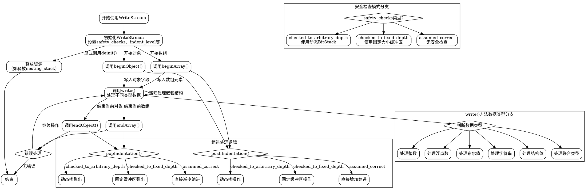

嗯，我需要根据提供的Zig代码中的WriteStream函数来绘制一个流程图。首先，我得仔细阅读代码，理解每个部分的功能和逻辑流程。代码看起来是一个用于生成JSON字符串的流式写入器，处理各种数据类型的序列化。

首先，函数WriteStream接受两个参数：OutStream类型和safety_checks_hint联合枚举。然后返回一个结构体，包含初始化、反初始化、开始数组/对象、结束数组/对象等方法，以及处理缩进、标点、嵌套结构等功能。

我需要确定主要的流程节点。比如初始化流程、开始数组、处理值、结束数组等步骤。每个方法如beginArray、beginObject、write等应该对应流程中的不同节点。还要注意错误处理和条件分支，例如不同的安全检查模式（checked_to_arbitrary_depth、checked_to_fixed_depth、assumed_correct）会影响流程的分支。

接下来，考虑流程图的结构。可能从初始化开始，然后根据不同的操作（如开始数组、写入值、结束数组）分支出不同的路径。每个操作内部可能有条件判断，比如安全模式的选择，或者是缩进的处理方式。此外，处理不同类型的数据（如整数、字符串、结构体）时，write方法会有不同的处理逻辑，这也需要体现在流程图中。

需要注意的是，代码中有很多条件判断和错误处理，例如在pushIndentation和popIndentation方法中，不同的safety_checks模式会导致不同的行为。此外，处理对象字段时，需要确保正确的标点符号（如逗号、冒号）的使用，这也需要在流程图中体现。

可能还需要考虑递归结构，比如处理嵌套的数组或对象时，indent_level和nesting_stack的变化。这些状态的变化需要在流程图中明确标注。

在绘制流程图时，应使用graphviz的语法，定义各个节点（矩形表示步骤，菱形表示条件判断），并用箭头连接它们。每个节点需要简明扼要地描述其功能，例如“初始化WriteStream”、“开始数组”、“写入整数值”等。条件节点则需要标明判断条件，如“安全检查模式是否为checked_to_arbitrary_depth？”。

最后，需要确保流程图的逻辑与代码一致，覆盖主要的分支和操作，同时保持图表的清晰和可读性。
================================================
