嗯，我需要为这个Zig代码生成一个流程图。首先，我得仔细看看这个代码的结构。看起来这是一个用于JSON序列化的WriteStream函数，里面有很多方法，比如beginArray、endArray、beginObject、endObject，还有处理缩进、标点符号、嵌套结构等等的逻辑。

首先，流程图应该从WriteStream的初始化开始。然后是各个主要的方法调用，比如开始数组或对象，添加字段，处理缩进，写入值，结束数组或对象等。每个方法内部可能有条件判断，比如安全检查模式的不同处理方式，或者根据不同的选项（如缩进方式）来决定如何写入空格或制表符。

接下来，我需要考虑流程的分支。例如，当调用pushIndentation时，根据safety_checks的不同类型（checked_to_arbitrary_depth、checked_to_fixed_depth、assumed_correct），处理方式不同。同样，在write方法中，根据不同的数据类型（整数、浮点数、布尔值、结构体、联合体等），处理逻辑也不一样。

还有错误处理的部分，比如每个方法都可能返回Error类型，需要在流程图中体现可能的错误路径。不过流程图通常不展示所有错误情况，所以可能需要简化这部分。

另外，像objectField和objectFieldRaw这样的方法，需要处理键名的写入，可能需要单独的流程分支。还有beginWriteRaw和endWriteRaw这样的方法，允许直接写入原始数据，这也是一个分支点。

在画流程图的时候，可能需要将主要的方法作为不同的节点，然后根据逻辑连接它们。例如，调用beginArray会进入一个节点，然后可能调用pushIndentation，接着处理缩进，然后写入'['字符，之后设置next_punctuation为none。结束数组时，调用endArray，处理缩进，写入']'字符，并更新状态。

对于处理不同类型值的write方法，可能需要多个分支节点，比如处理整数、浮点数、布尔值、结构体等，每个类型有不同的处理流程。例如，整数可能需要检查是否需要转换为字符串，浮点数需要判断是否精确转换为f64，结构体可能需要递归处理每个字段。

需要注意循环结构，比如在处理数组或对象时，可能会遍历元素，每个元素都调用write方法，这在流程图中可能需要循环节点。

可能还需要考虑初始化和释放资源的部分，比如init和deinit方法，但主要流程可能集中在序列化过程中。

总之，流程图需要覆盖主要的函数调用、条件分支、循环结构，以及状态的变化（如缩进级别、标点符号状态等）。可能需要将复杂的逻辑分解成子图，特别是处理不同类型值的部分，以保持流程图的清晰。
================================================

```dot
digraph WriteStream {
    rankdir=TB;
    node [shape=rectangle, style=rounded];

    // 初始化
    Start -> Init [label="初始化WriteStream"];
    Init -> BeginArray [label="beginArray"];
    Init -> BeginObject [label="beginObject"];
    
    // 数组操作
    BeginArray -> PushIndentation [label="pushIndentation"];
    PushIndentation -> WriteBracket [label="写入'['"];
    WriteBracket -> SetPunctuation [label="设置next_punctuation为none"];
    
    // 对象操作
    BeginObject -> PushIndentationObj [label="pushIndentation"];
    PushIndentationObj -> WriteBrace [label="写入'{'"];
    WriteBrace -> SetPunctuationObj [label="设置next_punctuation为none"];
    
    // 结束结构
    EndArray -> PopIndentation [label="popIndentation"];
    PopIndentation -> HandlePunctuation [label="处理逗号/缩进"];
    HandlePunctuation -> WriteCloseBracket [label="写入']'"];
    WriteCloseBracket -> ValueDone [label="标记值完成"];
    
    EndObject -> PopIndentationObj [label="popIndentation"];
    PopIndentationObj -> HandlePunctuationObj [label="处理逗号/缩进"];
    HandlePunctuationObj -> WriteCloseBrace [label="写入'}'"];
    WriteCloseBrace -> ValueDoneObj [label="标记值完成"];
    
    // 通用流程
    WriteValue -> ValueStart [label="valueStart"];
    ValueStart -> CheckPunctuation [label="检查标点状态"];
    CheckPunctuation -> WriteCommaOrIndent [label="处理逗号/缩进"];
    WriteCommaOrIndent -> WriteContent [label="写入内容"];
    WriteContent -> ValueDoneGeneric [label="标记值完成"];
    
    // 类型处理分支
    Write -> HandleInt [label="整数类型"];
    Write -> HandleFloat [label="浮点类型"];
    Write -> HandleBool [label="布尔类型"];
    Write -> HandleStruct [label="结构体"];
    Write -> HandleArray [label="数组类型"];
    HandleStruct -> BeginObject [label="递归处理字段"];
    HandleArray -> BeginArray [label="递归处理元素"];
    
    // 安全模式分支
    PushIndentation -> CheckSafetyMode [label="安全检查模式"];
    CheckSafetyMode -> ArbitraryDepth [label="checked_to_arbitrary_depth"];
    CheckSafetyMode -> FixedDepth [label="checked_to_fixed_depth"];
    CheckSafetyMode -> AssumedCorrect [label="assumed_correct"];
    
    // 缩进逻辑
    Indent -> CheckWhitespace [label="检查缩进选项"];
    CheckWhitespace -> WriteNewline [label="写入换行"];
    WriteNewline -> WriteSpacesOrTabs [label="写入空格/制表符"];
    
    // 原始写入模式
    BeginWriteRaw -> RawValueStart [label="标记原始模式"];
    RawValueStart -> DirectStreamWrite [label="直接写入流"];
    DirectStreamWrite -> EndWriteRaw [label="结束原始模式"];
    
    // 对象字段处理
    ObjectField -> EncodeKey [label="编码键名"];
    EncodeKey -> SetColon [label="设置冒号状态"];
    BeginObjectFieldRaw -> RawFieldStart [label="标记原始字段模式"];
    RawFieldStart -> DirectFieldWrite [label="直接写入字段"];
    DirectFieldWrite -> EndObjectFieldRaw [label="结束字段写入"];
    
    // 递归结束点
    ValueDone -> End [label="完成写入"];
    ValueDoneObj -> End;
    ValueDoneGeneric -> End;
}
```

### 流程图说明：
1. **初始化**：从`WriteStream.init`开始，初始化后可以选择开始数组或对象。
2. **结构操作**：`beginArray`/`beginObject`触发缩进处理和符号写入，`endArray`/`endObject`处理闭合逻辑。
3. **通用写入流程**：通过`valueStart`处理标点状态，`WriteContent`根据数据类型分支处理。
4. **类型分支**：`write`方法根据类型（整型、结构体等）递归处理嵌套结构。
5. **安全模式**：`pushIndentation`和`popIndentation`根据编译模式选择不同的栈实现。
6. **缩进逻辑**：根据`StringifyOptions.whitespace`选择空格或制表符。
7. **原始模式**：`beginWriteRaw`允许直接操作底层流，用于大数据量场景。
8. **对象字段**：`objectField`和`objectFieldRaw`提供键名的安全/直接写入模式。