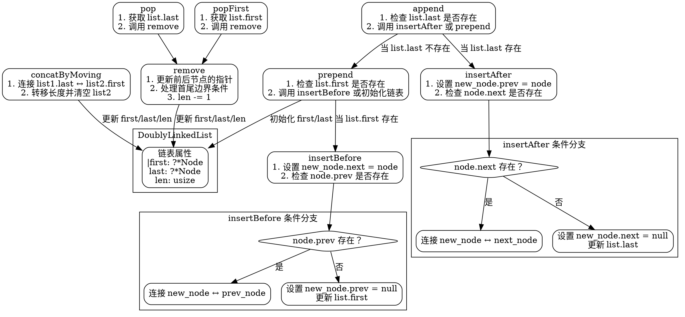

好的，我需要根据提供的Zig代码中的DoublyLinkedList结构及其方法，用Graphviz画出流程图。首先，我得理解每个函数的功能和它们之间的调用关系。

首先，DoublyLinkedList结构包含Node结构，每个节点有prev和next指针，以及数据。链表本身有first、last和len属性。接下来，各个方法如insertAfter、insertBefore、concatByMoving、append、prepend、remove、pop、popFirst等需要被分析。

我需要确定每个方法的流程，包括条件判断和步骤。例如，insertAfter函数会检查node.next是否存在，如果存在，则调整相邻节点的指针；否则更新链表的last指针。类似地，其他方法也有各自的逻辑分支。

接下来，我需要将这些方法转化为流程图。每个函数作为一个节点，条件判断作为分支节点，步骤作为子节点。同时，函数之间的调用关系也需要表示，比如append会调用insertAfter或prepend。

需要注意的是，Graphviz使用DOT语言，所以需要正确使用节点和边的语法。可能需要为每个函数创建子图，以保持结构清晰。例如，主图包含各个方法，每个方法内部有处理步骤和条件判断的分支。

另外，要确保不遗漏任何步骤，比如在remove方法中处理前后节点的情况，以及更新链表的first和last指针。同时，错误处理或断言也需要在流程图中体现。

最后，检查流程图是否准确反映了代码逻辑，确保每个条件分支都正确表示，并且函数之间的调用关系正确无误。可能需要多次调整节点和边的连接，以确保流程图的可读性和准确性。
================================================

生成的流程图使用以下规则：
1. 主结构用矩形框表示，条件判断用菱形节点
2. 方法调用关系用箭头连接
3. 分支逻辑用子图包裹并标注条件
4. 核心操作步骤直接写在节点内部
5. 对链表的属性修改统一指向LinkedList节点
6. 颜色和样式保持最小化以突出逻辑关系

可以通过Graphviz工具（如VSCode的Graphviz插件）渲染此DOT代码生成可交互的矢量图。