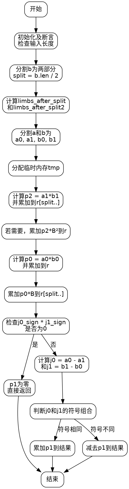

嗯，我需要为这个Zig函数绘制流程图。首先，我得理解这个函数的功能。看起来像是用Karatsuba算法进行大数乘法。函数名是llmulaccKaratsuba，可能是指低位乘法累加？

首先，函数参数有op、allocator、r、a、b。r是结果，a和b是乘数。函数里有很多注释，解释了Karatsuba算法的步骤。Karatsuba的核心是把大数分成两部分，递归计算三个乘积，然后合并结果。

接下来，函数开始的部分有一些断言，确保r的长度足够。然后定义了split变量，是b长度的一半，也就是分割点B。之后计算了limbs_after_split和limbs_after_split2，可能用于确定中间结果的存储空间。

然后分割a和b为a0、a1、b0、b1。这里用了llnormalize，可能是去除前导零的标准化操作。接着分配临时内存tmp，用于存储中间结果，比如p0、p1、p2。

计算p2的部分，用了llmulacc来累加乘积结果。然后通过llaccum将p2乘以B加到结果r的相应位置。如果还有剩余的部分（limbs_after_split2>0），则继续处理p2乘以B²的部分。

处理p0的时候，同样用llmulacc计算a0和b0的乘积，并累加到r中，同时处理p0乘以B的情况。

然后是计算p1的部分，这里比较复杂。需要比较a0和a1，b1和b0的大小，确定符号。如果其中有一个为零，就直接返回。否则，计算j0和j1的差值，根据符号决定是加还是减。

最后根据j0和j1的符号组合，决定是累加还是减去j0*j1的结果。这里用了条件判断，如果符号相同则直接累加，否则用相反的操作（比如加法变减法）。

整个流程需要考虑不同情况下的符号处理和内存管理，尤其是临时变量的分配和释放。可能需要注意递归调用或循环的部分，但在这个函数里看起来是单层的Karatsuba实现，没有递归。

为了画流程图，需要将主要步骤分解为节点，比如初始化、分割输入、计算p0、p1、p2，处理各个乘积的累加，以及条件判断处理符号。每个步骤之间的箭头表示执行顺序，条件分支需要判断符号是否为零或正负。

可能的结构是：

开始 -> 初始化和断言 -> 分割a和b -> 计算p2并累加 -> 处理p0 -> 处理p0*B -> 判断p1是否为零 -> 若否，计算j0和j1 -> 根据符号处理乘积 -> 结束。

需要详细标出各个步骤的条件分支，特别是符号相乘后的不同处理路径。
================================================
