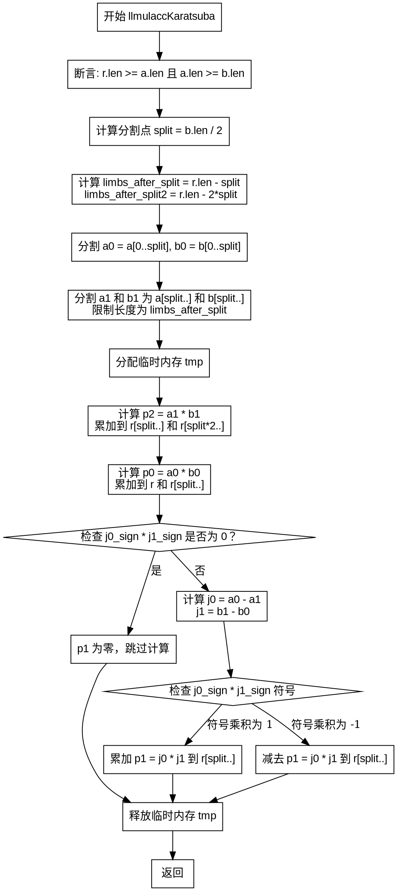

嗯，这个函数看起来是实现了大整数乘法的Karatsuba算法。我需要先理解这个函数的逻辑，然后才能画出流程图。首先，函数名是llmulaccKaratsuba，参数有操作类型、分配器、结果数组r、以及两个输入数组a和b。函数的作用应该是将a和b相乘的结果累加到r中，使用Karatsuba算法来优化乘法过程。

首先，函数开始部分有一些断言，确保r的长度足够，并且a的长度大于等于b的长度。接下来，注释里解释了Karatsuba算法的基本思想，将a和b各分成两部分，a1和a0，b1和b0，然后通过递归或更小的乘法来计算中间结果p0、p1、p2，最后将这些结果组合起来得到最终的乘积。

然后，代码中定义了split变量，应该是分割点，取b长度的一半。之后计算了limbs_after_split和limbs_after_split2，这些可能用于确定中间结果的有效位数，避免不必要的计算。

接下来，代码分割a和b为a0、a1、b0、b1。这里用到了llnormalize函数，可能是用来去除高位零的。分割后的a1和b1的长度被限制在limbs_after_split以内，可能是为了减少计算量。

然后分配了临时内存tmp，用于存储中间结果。计算p2的时候，使用llmulacc函数进行乘法累加，然后将结果p2累加到r的相应位置。同样处理p0，并两次累加到r的不同位置（直接累加和右移后的位置）。

处理p1的部分比较复杂，需要计算a0 - a1和b1 - b0的符号，然后根据符号的不同决定是加还是减中间乘积的结果。这里涉及到j0和j1的计算，以及根据它们的符号来确定最终的累加操作是加还是减。

整个流程的关键步骤包括分割输入、计算p0、p1、p2，然后通过累加这些中间结果到正确的位置，同时处理符号和溢出。需要注意各个部分的长度限制和临时内存的使用。

现在，我需要把这些步骤转化为流程图。流程图应该从函数入口开始，依次展示各个步骤的判断和处理。例如：

1. 检查参数有效性（断言）。
2. 计算分割点split。
3. 分割a和b为a0, a1, b0, b1。
4. 分配临时内存tmp。
5. 计算p2并累加到r。
6. 计算p0并累加到r。
7. 处理p1：计算j0和j1的符号，根据符号进行乘法并累加或减去。

需要注意条件判断的部分，比如当j0_sign或j1_sign为零时，直接跳过p1的计算；当符号相乘为1或-1时，选择不同的操作。此外，临时内存的分配和释放也需要在流程中体现。

可能的分支包括：

- 当limbs_after_split2 > 0时，处理p2的B^2项。
- 当j0_sign * j1_sign == 0时，跳过p1的计算。
- 根据j0_sign和j1_sign的正负，选择不同的操作（加或减）。

在画流程图时，应该用不同的形状表示开始/结束、处理步骤、条件判断、输入/输出等。例如，矩形框表示处理步骤，菱形表示条件判断，箭头表示流程方向。同时，需要确保各个步骤之间的逻辑关系正确，特别是条件分支后的不同路径。
================================================
