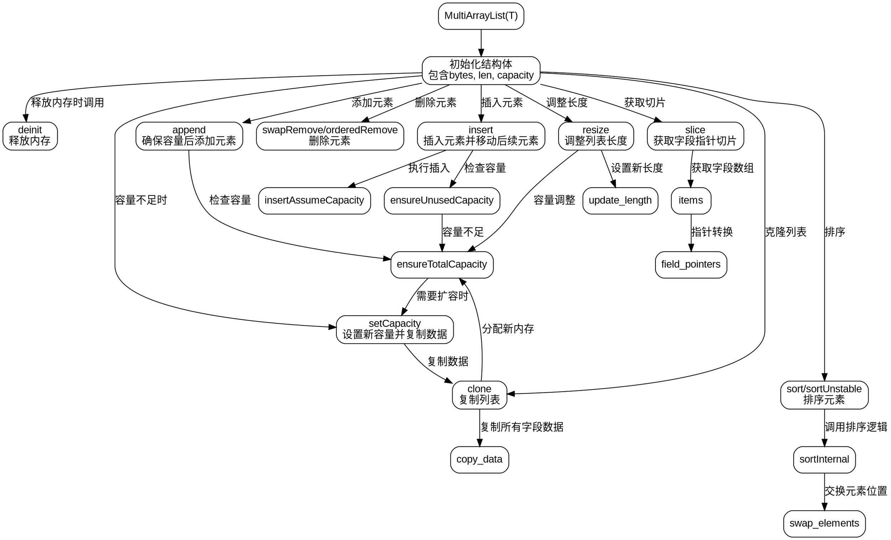

嗯，我需要为这个Zig语言的MultiArrayList函数画一个流程图。首先，我得理解这个函数的结构和各个部分的作用。看起来这是一个泛型结构，用于管理多个数组列表，支持结构体和带标签的联合体。

首先，我应该确定主要的函数和结构体。MultiArrayList是一个返回类型的函数，它定义了一个包含bytes、len和capacity的结构体。里面有很多方法，比如deinit、append、insert、sort等等。还有内部的结构体Slice，用于管理字段的指针。

接下来，我需要把整个流程分解成几个主要部分：初始化、内存管理（分配和释放）、添加元素、删除元素、排序、切片操作等。每个部分都有对应的函数，比如ensureTotalCapacity用于确保容量，setCapacity用于设置容量，clone用于复制列表等。

流程图应该从结构体的创建开始，然后展示各个方法的调用流程。例如，当调用append时，会先检查容量，不够的话就扩容，然后添加元素。插入元素时可能需要移动现有元素，删除元素也有不同的方法，比如swapRemove和orderedRemove，这两种方法的处理流程不同。

另外，排序部分涉及到sortInternal函数，根据不同的排序模式（稳定或不稳定）调用不同的排序算法。这里需要展示排序的流程，包括比较元素和交换元素的位置。

需要注意错误处理，比如在内存分配失败时的处理，但流程图可能不需要详细展示错误分支，除非特别重要。另外，内部使用的辅助函数如growCapacity、FieldType等也需要适当体现。

最后，确保流程图的各个部分连接合理，逻辑清晰，使用graphviz的语法正确，不要使用mermaid。
================================================
