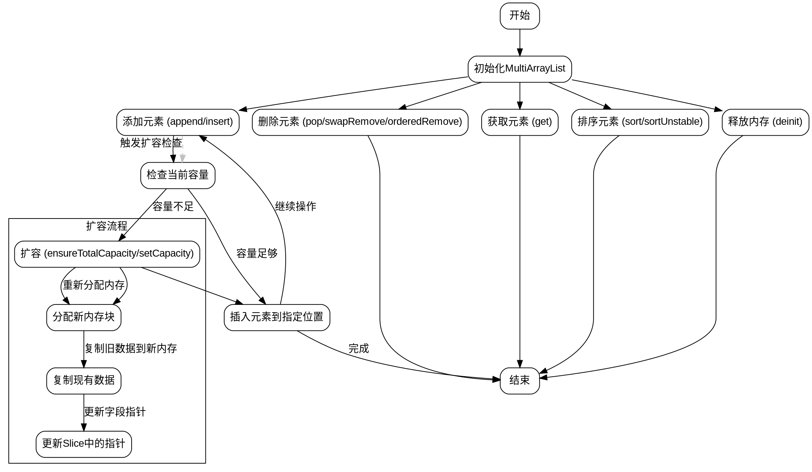

嗯，我需要为这个Zig函数MultiArrayList画一个流程图。首先，我得理解这个函数是做什么的。看起来这是一个实现多数组列表的结构，可能是用来高效管理结构体或联合体的数组，每个字段存储在不同的连续内存块中。这样的话，访问不同字段时可以更高效，尤其是当只需要部分字段的时候。

首先，我应该先看一下这个结构的定义。它有一个bytes指针，len和capacity。然后定义了一些内部类型，比如Elem，根据T的类型不同有不同的处理。如果是结构体，Elem就是T本身；如果是联合体，则处理标签和数据部分。接着有Field枚举，可能是用来表示各个字段的。

接下来是Slice结构，里面保存了各个字段的指针，这样访问不同字段的时候可以直接用这些指针，而不需要每次都计算偏移量。Slice还有items、set、get等方法，用于操作具体字段的数据。

然后是各种方法，比如deinit释放内存，append添加元素，insert插入元素，remove删除元素，sort排序等等。这些方法应该对应流程图的各个步骤。

画流程图的时候，可能需要从初始化开始，然后是添加元素、扩容、访问元素、删除元素、排序等操作。每个操作内部可能有分支，比如是否需要扩容，处理结构体和联合体的不同情况，等等。

不过，因为代码比较长，我需要确定哪些是关键的函数和流程。例如，append会调用ensureUnusedCapacity来确保容量足够，然后添加元素。而ensureUnusedCapacity又会调用setCapacity来调整内存大小。这些函数之间的调用关系需要体现在流程图中。

另外，处理结构体和联合体的不同逻辑可能需要不同的分支。比如，在set和get方法中，如果是联合体，需要处理标签和数据部分，而结构体则直接处理字段。

可能还需要考虑内存布局，比如每个字段的内存是如何分配的，根据对齐和大小进行排序，这在sizes的计算部分有体现。

流程图应该从主结构MultiArrayList开始，展示其主要操作，如初始化、添加元素、删除元素、扩容、获取切片等，并标出各个步骤的条件和循环。对于像排序这样的复杂操作，可能需要简化为一个步骤，或者进一步分解。

需要注意的是，这个结构支持结构体和带标签的联合体，所以在流程图中需要体现这些类型的不同处理路径。例如，当T是联合体时，需要处理标签和数据的转换。

此外，错误处理也是一个部分，比如在分配内存时可能失败，需要有错误返回的路径。

综上所述，流程图的大致结构可能包括：

1. 初始化MultiArrayList
2. 添加元素（append/insert）
   a. 检查容量
   b. 扩容（如果需要）
   c. 插入元素到正确位置
3. 删除元素（pop/swapRemove/orderedRemove）
4. 获取元素（get）
5. 调整容量（ensureTotalCapacity/setCapacity）
6. 排序（sort/sortUnstable）
7. 释放内存（deinit）

每个步骤内部的具体操作需要根据代码逻辑细化。例如，扩容时如何重新分配内存并复制数据，排序时如何交换元素等。

可能遇到的挑战是如何将复杂的逻辑简化成图形化的流程，尤其是处理不同数据类型（结构体/联合体）的分支。另外，内存管理的部分（分配、释放、复制）也需要清晰表示。

需要确认是否要详细画出每个函数的内部流程，还是只画出主要的公共接口。根据问题描述，可能更关注整体的结构和方法之间的关系，而不是每个函数的每一个细节。

最后，确保流程图的每个节点和分支清晰，逻辑正确，能够帮助理解MultiArrayList的工作机制。
================================================

### 流程图说明：
1. **初始化**：创建`MultiArrayList`结构，初始化内存指针和容量。
2. **添加元素**：
   - 检查当前容量，不足时触发扩容。
   - 扩容流程包含重新分配内存、复制数据、更新指针。
   - 将元素插入到正确位置（结构体直接存储，联合体需处理标签和数据）。
3. **删除元素**：支持交换删除和有序删除，更新长度。
4. **获取元素**：通过`Slice`结构快速访问字段数据。
5. **排序**：根据上下文定义的比较函数进行稳定或不稳定排序。
6. **内存管理**：释放所有分配的内存块，重置状态。

图中虚线表示隐式触发逻辑（如`append`自动触发容量检查），实线表示直接操作流程。灰色箭头用于辅助说明关联性。