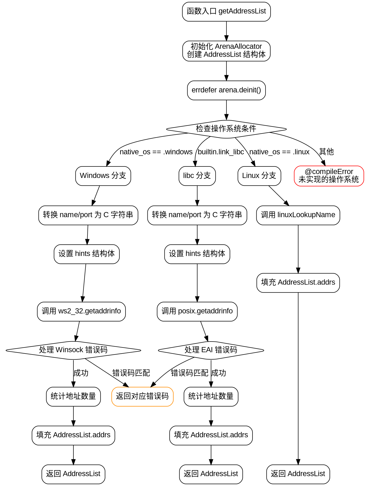

嗯，用户让我用Graphviz画这个Zig函数的流程图。首先，我需要理解这个函数的结构。这个函数名为getAddressList，看起来是用于获取地址列表的，支持不同操作系统，比如Windows、Linux，还有使用libc的情况。

首先，我会从函数的整体结构开始分析。函数开始处有一个blk块，初始化了一个ArenaAllocator，创建了AddressList结构体。然后根据不同的操作系统或条件（如是否链接libc）分成了不同的处理分支：Windows部分、使用libc的情况、Linux部分，最后如果都不符合则编译错误。

接下来，我需要确定每个分支的处理流程。对于Windows分支，它处理了getaddrinfo的调用，错误处理，然后遍历结果填充地址列表。同样，使用libc的部分也调用了getaddrinfo，处理错误，然后填充地址。Linux部分则调用了linuxLookupName函数，处理结果。

流程图的关键节点包括：初始化ArenaAllocator，错误处理（errdefer），不同OS的条件判断，调用系统API（如getaddrinfo），处理返回结果，填充地址列表，返回结果等。

需要注意条件分支，比如if (native_os == .windows)，if (builtin.link_libc)，if (native_os == .linux)，这三个分支是互斥的，流程图中需要明确这些条件的分支路径。

另外，每个分支内部可能有循环，比如Windows部分中的while (true)循环，用于处理可能的WSANOTINITIALISED错误并重试。还有遍历地址链表时的循环，统计地址数量，填充数组等。

在绘制流程图时，应该用不同的节点表示函数调用、条件判断、循环、错误处理等。例如，开始节点是函数入口，然后初始化ArenaAllocator，接着条件判断操作系统，每个分支处理各自的逻辑，最后返回结果或错误。

可能还需要处理错误路径，比如errdefer的清理操作，以及各个错误码的返回。但流程图可能不需要详细到每个错误码，而是概括主要的错误处理路径。

总结步骤：
1. 函数入口，初始化Arena和AddressList。
2. 错误处理节点（errdefer）。
3. 判断操作系统或条件，分为Windows、libc、Linux三个分支。
4. 每个分支内的处理流程：转换参数为C字符串，调用系统API，处理结果，填充地址列表。
5. 返回结果或错误。

现在需要考虑如何将这些步骤转化为Graphviz的节点和边，合理布局，确保逻辑清晰，分支明确。
================================================
