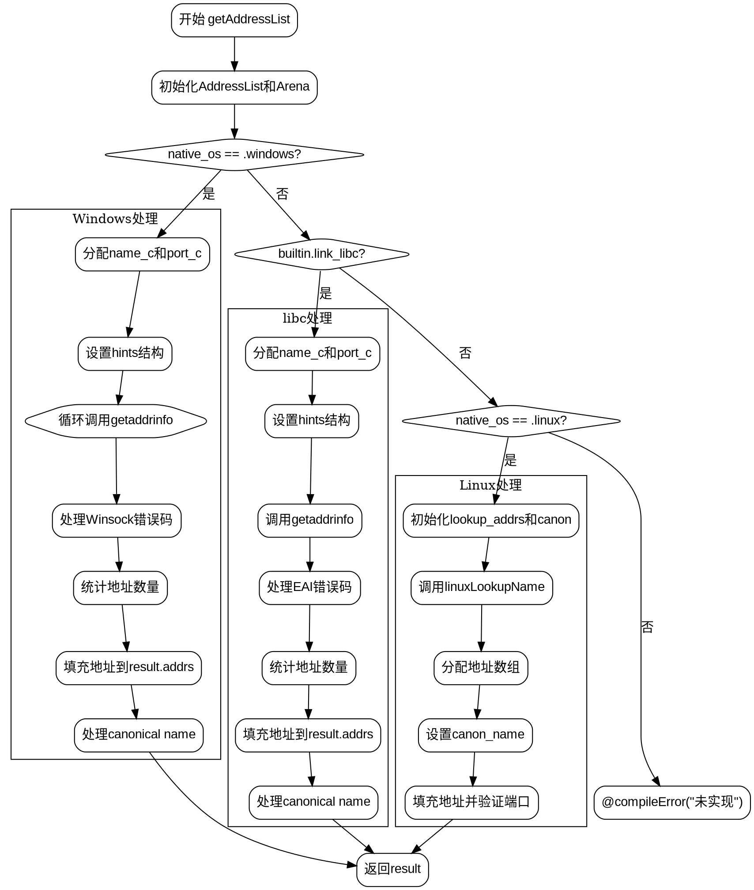

嗯，我需要为这个Zig函数`getAddressList`绘制流程图。首先，我得仔细看看代码的结构，理解各个分支和逻辑流程。

函数开始于创建一个`AddressList`，然后根据不同的操作系统处理不同的情况。首先检查是否是Windows，然后是否是使用libc的情况，接着是Linux，最后如果都不符合则抛出编译错误。每个操作系统分支都有自己的处理逻辑，比如调用不同的系统API（如Windows的`getaddrinfo`，Linux的`linuxLookupName`）。

我需要确定每个条件判断的分支，比如`native_os == .windows`、`builtin.link_libc`、`native_os == .linux`，以及各个错误处理路径。此外，每个分支内部可能有循环和资源管理操作，如`defer`语句释放内存。

接下来，流程图应该从函数入口开始，分支出不同的操作系统处理路径。每个路径内部需要展示关键步骤：分配内存、调用系统函数、处理结果、错误处理，以及返回结果。特别注意`errdefer`和`defer`的使用，这些会影响资源释放的流程。

可能的结构是：

1. 初始化AddressList和Arena。
2. 判断操作系统：
   a. Windows路径：处理WS2_32的getaddrinfo，处理可能的错误，遍历结果填充地址列表。
   b. 使用libc的情况：类似Windows的处理，但使用posix的getaddrinfo。
   c. Linux路径：调用linuxLookupName，处理地址。
3. 每个路径结束后返回结果。
4. 错误处理和资源释放穿插在各个步骤中。

需要注意循环结构，比如Windows中的`while (true)`循环处理WSANOTINITIALISED的情况，以及遍历地址链表的部分。

最后，确保流程图的每个节点正确反映代码逻辑，包括条件判断、循环、函数调用和错误返回。
================================================
