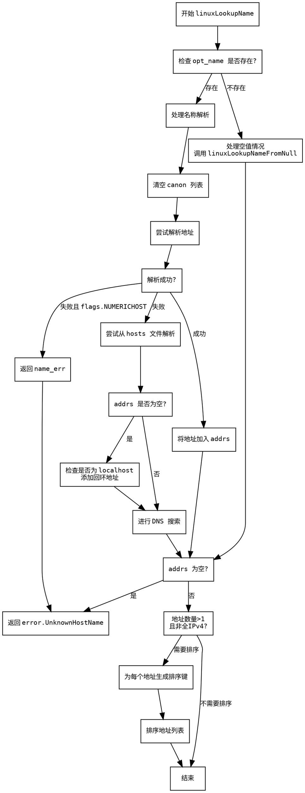

好的，我现在需要根据提供的Zig代码为`linuxLookupName`函数绘制流程图。首先，我需要仔细阅读代码，理解其逻辑结构和各个条件分支。

首先，函数开始时会检查`opt_name`是否存在。如果存在，则处理名称解析；如果不存在，则调用`linuxLookupNameFromNull`。这里需要分两个主要分支：处理名称和处理空值的情况。

在处理名称的部分，代码尝试将名称解析为地址。如果解析成功，将地址添加到`addrs`列表中。如果失败且设置了`NUMERICHOST`标志，则返回错误。否则，会尝试从hosts文件解析，如果仍然没有结果，会检查是否为`localhost`并添加回环地址。如果还是没有结果，则进行DNS搜索。

接下来，如果`addrs`为空，则返回错误。之后，根据地址的数量和类型决定是否进行排序。如果有多个地址且不是全IPv4，则进行排序逻辑。这里涉及到生成排序键，并根据RFC 3484/6724进行排序。

在生成排序键的过程中，代码处理IPv6和IPv4的不同情况，创建对应的socket地址结构，进行连接测试，计算策略、作用域、前缀匹配等，最后生成排序键并对地址列表进行排序。

现在需要考虑如何将这些步骤转化为流程图。流程图的开始是函数入口，然后根据`opt_name`是否存在分为两个分支。每个分支内部有多个条件判断和子过程调用。处理完主要逻辑后，进入排序逻辑的条件判断，最后进行排序操作并结束。

需要注意各个条件之间的连接，例如解析失败后的错误处理、localhost的特殊处理、DNS搜索等。同时，排序逻辑中的循环和条件判断也需要正确表示。

可能遇到的挑战是如何清晰地表达复杂的条件分支和循环结构，尤其是排序键生成部分的多个步骤。需要确保每个判断和操作在流程图中都有对应的节点，并且箭头正确指示流程方向。

总结步骤：
1. 函数开始。
2. 检查`opt_name`是否存在。
3. 存在时处理名称解析，尝试解析地址，处理错误，检查hosts，处理localhost，进行DNS搜索。
4. 不存在时调用`linuxLookupNameFromNull`。
5. 检查`addrs`是否为空，若空则返回错误。
6. 判断是否需要排序（地址数量>1且非全IPv4）。
7. 生成排序键，处理IPv6和IPv4的不同情况，进行socket操作，计算策略和作用域。
8. 根据排序键排序地址列表。
9. 结束。

需要将这些步骤用合适的图形元素（如判断菱形、过程矩形、箭头连接）表示，确保逻辑清晰。
================================================
