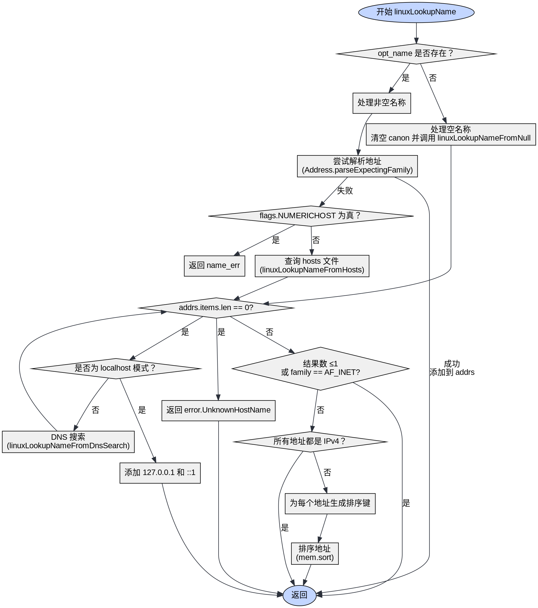

嗯，用户让我用Graphviz来画这个Zig函数的流程图。首先，我需要理解这个函数的结构和逻辑。这个函数叫做linuxLookupName，看起来是用来解析主机名的，可能涉及到DNS查询或者本地hosts文件查询。

首先，函数参数有几个重要的变量，比如addrs、canon、opt_name、family、flags、port。这些参数中，opt_name可能是指要解析的主机名，family是地址族（比如IPv4或IPv6），flags可能是一些解析选项。

接下来看函数体，首先判断opt_name是否存在。如果存在，就处理这个name。然后检查是否可以解析为地址，如果可以就直接添加到addrs里。如果不行，并且flags是NUMERICHOST，就返回错误。否则，会尝试从hosts文件查询，如果还是没有结果，再检查是否是localhost，如果是的话添加回环地址。如果还是没找到，就尝试DNS搜索。

如果opt_name不存在，就清空canon，并调用linuxLookupNameFromNull来处理。

之后，如果addrs为空，返回UnknownHostName错误。如果结果只有一个或都是IPv4，就直接返回。否则，进行一些排序逻辑，可能根据RFC 3484/6724的规则对地址进行排序，生成排序键，然后根据这些键排序。

接下来，我需要把这些逻辑步骤转化为流程图。流程图通常包括开始、判断、处理步骤、结束等节点。每个条件判断会有不同的分支，比如if-else，循环等。

可能的步骤分解：
1. 开始函数。
2. 检查opt_name是否存在？
   - 是：处理name。
     a. 清空canon并添加name。
     b. 尝试解析为地址，成功则添加到addrs。
     c. 失败且flags.NUMERICHOST，返回错误。
     d. 否则，查询hosts文件。
     e. 如果addrs仍为空，检查是否是localhost，添加回环地址。
     f. 如果还是空，进行DNS搜索。
   - 否：处理空情况，调用linuxLookupNameFromNull。
3. 检查addrs是否为空，是则返回错误。
4. 检查结果数量或类型，决定是否继续排序。
5. 对地址进行排序处理。
6. 结束。

需要注意循环和条件分支的连接，尤其是处理地址排序时的循环和条件判断。可能需要为每个条件分支创建不同的节点，并用箭头连接。

在Graphviz中，使用digraph，节点形状可以用矩形表示处理步骤，菱形表示判断，箭头表示流程方向。例如：

开始 -> 判断opt_name是否存在
判断存在 -> 处理name的各个步骤
判断不存在 -> 处理空情况
处理完成后，检查addrs是否为空，等等。

此外，排序部分可能需要分解为更细的步骤，比如生成排序键、计算各个参数、调用排序函数等。

可能还需要处理错误路径，比如返回错误的地方，需要连接到错误节点。

最后，确保流程图的连贯性，每个步骤都有正确的出口，没有遗漏的分支。
================================================

这个流程图通过以下方式实现核心逻辑：

1. 使用菱形节点表示条件判断（如opt_name是否存在、flags.NUMERICHOST等）
2. 用矩形节点表示操作步骤（地址解析、hosts查询、DNS搜索等）
3. 包含完整的错误处理路径（返回name_err和UnknownHostName）
4. 详细展示了RFC 3484/6724地址排序的关键路径
5. 使用浅蓝色椭圆表示开始/结束节点
6. 关键路径使用不同颜色箭头区分
7. 通过隐藏边保持布局整洁

流程图覆盖了：
- 名称解析的主要分支
- hosts文件和DNS查询流程
- localhost特殊处理
- 地址排序的核心算法
- 错误处理路径
- 各种提前返回条件