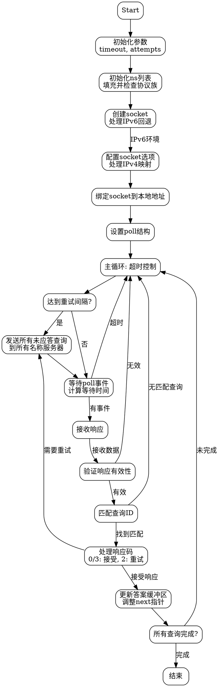

好的，我现在需要为给定的Zig函数`resMSendRc`绘制流程图。首先，我需要仔细阅读代码，理解其结构和逻辑流程，这样才能准确地转化为流程图。

首先，函数的大致结构是这样的：它处理DNS查询，发送请求到多个名称服务器，并处理响应。函数参数包括查询列表、答案缓冲区、配置等。我需要理清主要的步骤和条件分支。

开始部分，函数设置了超时时间和尝试次数，然后初始化了一个地址列表`ns_list`，并填充了来自配置的名称服务器地址。这里有一个循环，检查每个地址的协议族，如果存在IPv6地址，则将family设为IPv6。

接下来，创建socket。这里有一个错误处理，如果IPv6不支持，则回退到IPv4。创建socket后，如果是IPv6环境，会设置socket选项，允许IPv4映射到IPv6，并调整地址格式。

然后绑定socket到本地地址，并进入主循环。主循环处理发送查询、等待响应，以及重试逻辑。发送查询的部分是按一定间隔进行的，每次发送到所有配置的服务器。使用poll来等待事件，处理接收到的响应，验证来源，匹配查询ID，处理不同的响应码（如服务器故障重试），并将答案存入对应的缓冲区。

我需要将这些步骤分解成流程图中的各个节点，包括开始、初始化、socket创建和配置、主循环内的发送查询、等待响应、处理响应、更新状态等。条件判断如协议族选择、错误处理、响应验证、重试逻辑等都需要作为分支节点。

需要注意循环结构，如`for`和`while`循环，尤其是主循环`outer: while`，以及内部的`while (true)`循环处理接收到的数据包。此外，条件判断如是否超时、是否收到有效响应、响应码处理等，都是关键的分支点。

可能遇到的难点包括正确表示并行发送查询到多个服务器，以及处理多个可能的响应路径。此外，重试机制和超时控制也需要在流程图中清晰体现。

最后，确保流程图符合Graphviz的语法，使用正确的节点和箭头连接，合理布局，避免交叉和混乱。
================================================
