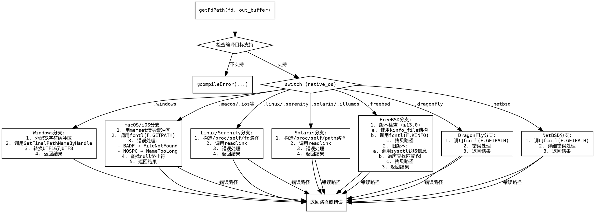

嗯，我需要帮用户用Graphviz画出这个Zig函数的流程图。首先，我得仔细看一下这个函数的代码结构。看起来这个函数是针对不同操作系统处理文件描述符路径的。首先，函数有一个编译时检查，判断当前目标系统是否支持getFdPath，如果不支持就抛出编译错误。

接下来是switch语句，根据不同的操作系统执行不同的代码块。例如，Windows系统使用GetFinalPathNameByHandle，macOS及其衍生系统使用fcntl的F.GETPATH命令，Linux和Serenity通过/proc/self/fd/读取符号链接，Solaris和Illumos使用/proc/self/path/，FreeBSD有不同版本的处理，DragonFly和NetBSD也有各自的实现。每个分支处理后返回路径或错误。

我需要将这些逻辑转化为流程图。流程图应该从函数入口开始，判断是否支持目标系统，如果不支持就报错。然后根据不同的操作系统分支，每个分支内的处理步骤也要细化，比如Windows调用特定函数，转换编码，返回结果；macOS使用fcntl，处理错误码，返回路径长度等等。每个分支结束后返回相应的结果或错误。

需要注意每个case中的错误处理，比如检查errno，返回不同的错误类型。例如，在macOS部分，如果fcntl返回错误，可能会返回FileNotFound或NameTooLong等错误。流程图需要体现这些错误路径。

另外，FreeBSD的处理比较复杂，分为两个情况：版本大于等于13.0使用kinfo_file结构，否则使用sysctl方法。这部分需要拆分成两个子流程，可能需要用子图来表示。

还有，每个分支结束后都会返回结果，所以流程图中的每个分支最终都要指向结束节点。可能还需要处理一些共同的步骤，比如在Linux和Solaris中读取符号链接，处理可能的错误情况。

需要注意的是，Graphviz的语法需要使用正确的节点和边，合理使用条件判断和子图来组织不同的操作系统处理流程。可能需要将每个操作系统分支作为不同的子流程，并在主流程中根据条件跳转到对应的子流程。

在绘制时，可能需要将每个switch case作为一个菱形判断节点，然后连接到各自的操作系统处理块，每个处理块内部再展开具体的步骤，包括函数调用、错误检查、返回值等。错误路径需要明确标出，比如返回不同的错误类型。

最后，确保整个流程图的结构清晰，每个分支的处理步骤正确无误，没有遗漏任何重要的逻辑步骤，尤其是错误处理部分。同时，注意节点之间的连接箭头方向正确，避免交叉过多，保持可读性。
================================================
