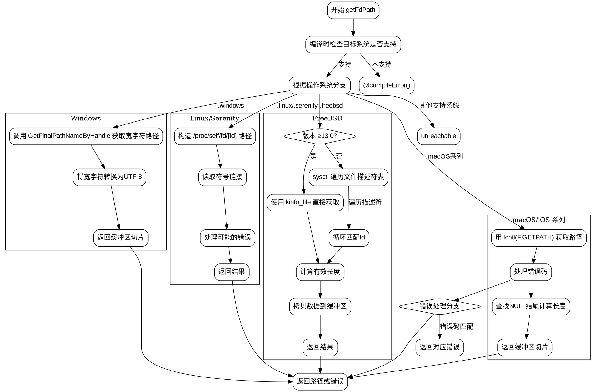

好的，我需要为给定的Zig函数`getFdPath`绘制流程图。首先，我需要理解这个函数的结构和逻辑。

函数开始处有一个编译时检查，确保目标操作系统支持`getFdPath`。如果不支持，会抛出编译错误。接下来，根据不同的操作系统分支处理不同的逻辑。每个操作系统分支（如Windows、macOS、Linux等）有不同的实现方式。例如，Windows使用`GetFinalPathNameByHandle`，macOS使用fcntl的F.GETPATH命令，而Linux通过读取/proc/self/fd下的符号链接来获取路径。

我需要将这些逻辑分支转化为流程图中的决策节点和操作步骤。首先，主流程开始于编译检查，接着根据操作系统分支到不同的处理块。每个操作系统块内部有具体的步骤，如调用系统函数、处理错误、转换编码等。此外，需要注意错误处理流程，比如返回不同的错误类型。

在绘制流程图时，需要考虑以下几点：
1. 主流程的分支结构，特别是switch语句中的不同操作系统情况。
2. 每个分支内的具体步骤，包括函数调用、错误处理、数据处理（如编码转换）。
3. 错误处理路径，如何从错误判断返回到错误返回。
4. 不同操作系统的特定处理逻辑之间的差异。

可能需要使用条件判断节点来表示不同的操作系统分支，每个分支内部包含一系列操作步骤和可能的子判断。例如，在FreeBSD分支中，根据版本不同有两种处理方式，这需要进一步的条件判断。

此外，需要注意循环结构，例如在FreeBSD的fallback实现中有一个while循环来遍历文件描述符信息。这需要在流程图中正确表示循环的开始、条件和结束。

最后，确保所有可能的路径都被覆盖，包括正常返回和错误返回的情况。流程图应清晰展示函数的执行流程，便于理解不同操作系统下的处理逻辑及其相互关系。
================================================
