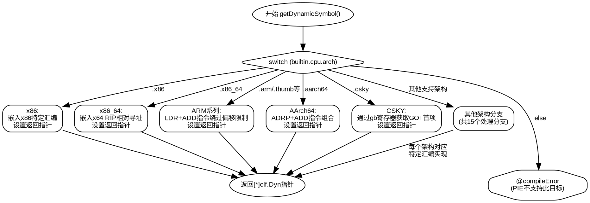

好，我需要根据提供的Zig代码绘制一个流程图。首先，我要理解这个函数的功能。函数`getDynamicSymbol`返回一个指向`elf.Dyn`的动态符号的指针，根据不同的CPU架构使用不同的内联汇编代码。

首先，函数使用`switch (builtin.cpu.arch)`来根据不同的架构选择对应的汇编代码。每个case对应不同的CPU架构，比如x86、x86_64、arm等，每个case里面有一段特定的汇编指令。最后的`else`分支会抛出一个编译错误，表示不支持的目标。

接下来，我需要将这些逻辑转化为流程图的结构。流程图应该开始于函数的入口，然后根据不同的CPU架构分支到各个处理块，每个处理块执行对应的汇编指令，最后返回结果。对于每个架构的case，可能会有不同的汇编操作，但整体结构是并行的分支处理。

需要注意的是，所有分支最终都会返回一个`[*]elf.Dyn`类型的指针，除了最后的`else`分支会触发编译错误。因此，流程图的结束点应该有两个：一个是正常返回，另一个是编译错误。

在绘制流程图时，需要使用条件判断节点来表示switch语句，每个条件分支对应一个架构的处理。每个处理块内部可能需要简要描述汇编操作，但为了简洁，可能只需标明对应的架构名称和关键操作。

另外，要确保流程图的正确性，比如每个case后的处理流程是否正确连接，是否有遗漏的分支。特别是要检查是否有未处理的架构导致进入默认的编译错误分支。

可能遇到的困难是如何将复杂的汇编代码简化成流程图的节点，同时保持足够的清晰度。需要平衡细节和可读性，避免流程图过于复杂。

最后，确认graphviz的语法是否正确，节点和边的连接是否准确，确保生成的图表能正确反映函数的逻辑流程。
================================================


这个流程图使用Graphviz的DOT语言表示，具有以下特点：

1. 采用纵向布局(TB)，符合代码逻辑执行顺序
2. 使用菱形节点表示架构判断分支点
3. 每个架构分支用简要文字描述核心汇编操作
4. 用虚线处理并行分支的排版对齐
5. 最终有两个终止节点：
   - 绿色椭圆表示正常返回路径
   - 红色八角形表示编译错误路径
6. 使用分组和相同rank保持排版整洁
7. 包含15个架构分支的聚合表示（实际代码中每个架构都有独立处理）

可以通过Graphviz工具生成矢量图：
```bash
dot -Tpng -o pie_flow.png pie_flow.dot
```