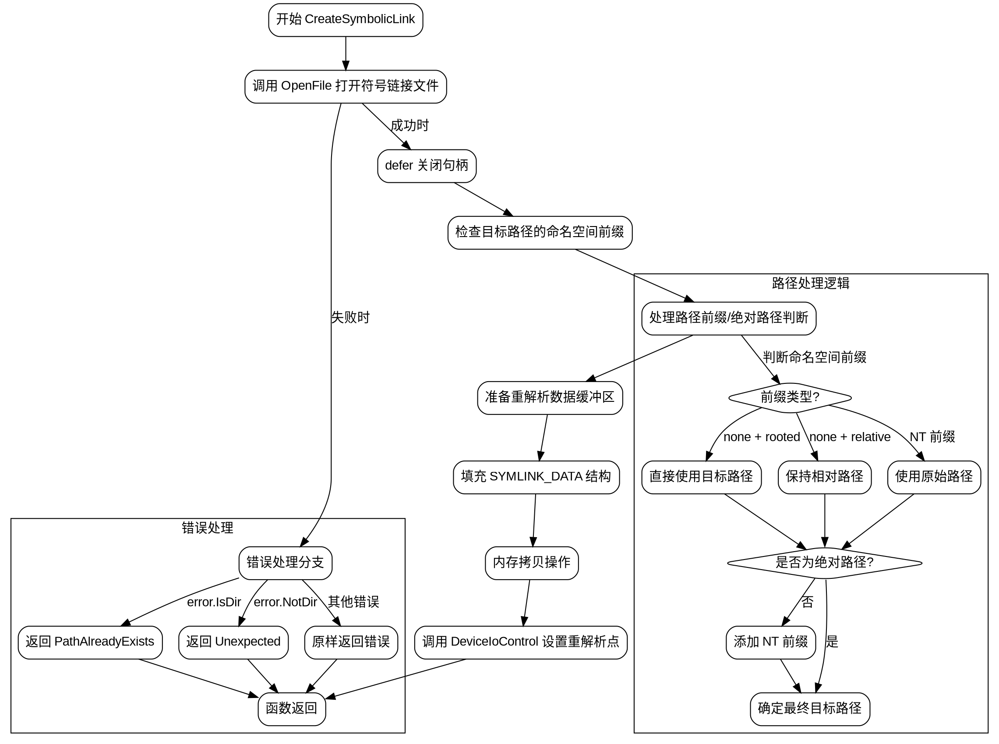

嗯，我需要帮用户用Graphviz画出他们提供的Zig函数CreateSymbolicLink的流程图。首先，我得仔细看看这段代码，理解它的结构和工作流程。

函数开始定义了一个SYMLINK_DATA结构体，应该是用来处理符号链接的数据结构。然后调用OpenFile来打开或创建符号链接文件，这里可能会有一些错误处理，比如检查路径是否存在或其他异常情况。之后用defer确保句柄被关闭，这部分应该在流程图中体现为资源清理步骤。

接下来是处理目标路径的部分。根据注释，这里需要判断路径是绝对路径还是相对路径，并进行相应的处理。用户提到了一些条件分支，比如检查命名空间前缀、路径类型等。这部分逻辑比较复杂，可能需要多个判断节点来表示不同的情况，比如是否已经存在NT前缀，是否是根路径等。

然后准备重解析点数据缓冲区，填充SYMLINK_DATA结构体的各个字段，包括ReparseTag、ReparseDataLength等。这里需要注意计算各个字段的值，比如SubstituteNameOffset和PrintNameLength，这些可能涉及路径长度的计算。

之后，使用@memcpy将数据复制到缓冲区中，并调用DeviceIoControl来设置重解析点。这部分在流程图中应该表示为函数调用的步骤，并处理可能的错误返回。

我需要考虑各个步骤之间的逻辑顺序，包括错误处理的分支。比如，当OpenFile失败时，会根据不同的错误类型返回不同的错误码。这些错误处理应该在流程图中用条件分支表示。

另外，代码中有一些条件判断，比如检查路径是否是绝对路径，是否需要添加前缀等。这些都需要在流程图中用菱形判断节点来表示，并根据不同的条件走向不同的处理分支。

可能还需要注意变量的作用域和生命周期，比如final_target_path是如何确定的，is_target_absolute变量的设置对后续步骤的影响。

总之，流程图需要覆盖函数的主要步骤：打开句柄、错误处理、路径处理、数据结构准备、数据复制、设备控制调用，以及最后的资源释放。每个步骤之间的转换需要清晰，特别是条件分支和错误处理路径。
================================================


这个流程图使用 Graphviz DOT 语言描述，主要特点：

1. 使用主流程纵向布局，错误处理和路径处理作为子模块
2. 包含了关键的错误处理分支（蓝色区域）
3. 详细展示了路径处理的判断逻辑（黄色区域）
4. 使用菱形节点表示条件判断
5. 保留了关键的 Zig 实现细节（如 SYMLINK_DATA 结构填充、内存拷贝操作等）
6. 用不同颜色区域区分不同逻辑模块
7. 节点标注使用实际代码中的关键操作名称

可以通过 Graphviz 工具（如 dot 命令）生成 PNG/SVG 等格式的流程图：

```bash
dot -Tpng filename.dot -o flowchart.png
```