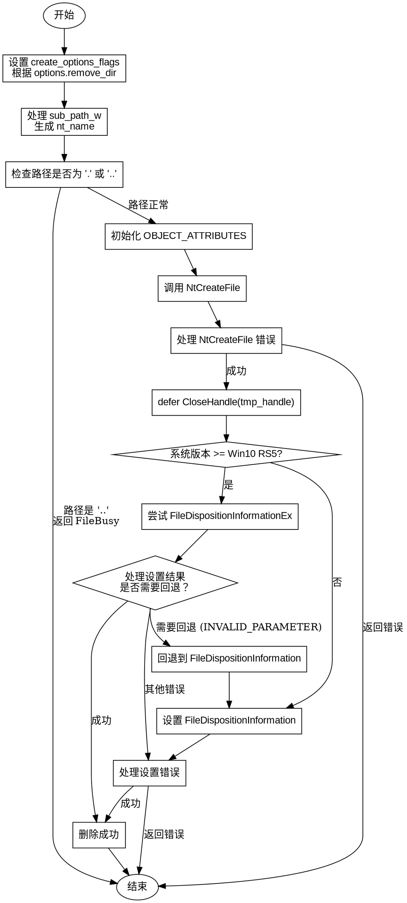

嗯，我现在需要帮用户用Graphviz画一个函数DeleteFile的流程图。首先，我得仔细读一遍这个Zig代码，理解它的逻辑结构。看起来这个函数是用来删除文件的，里面有很多Windows系统API的调用，比如NtCreateFile和NtSetInformationFile，还有一些错误处理。

首先，函数开始检查options.remove_dir是否为真，决定create_options_flags的值。接着处理sub_path_w，生成nt_name结构体。然后处理特殊情况，比如路径是"."或者".."，这里需要设置nt_name.Length或者返回错误。

接下来是OBJECT_ATTRIBUTES的初始化，然后调用NtCreateFile来打开文件或目录。根据返回的状态码处理不同的错误情况，比如FileNotFound、IsDir、AccessDenied等等。如果成功，就继续执行，并延迟关闭句柄。

然后进入设置文件处置信息的步骤。这里有两个可能的路径：如果系统是Win10 RS5或更高，尝试使用FileDispositionInformationEx，如果失败（比如INVALID_PARAMETER），则回退到FileDispositionInformation。否则直接使用后者。每个步骤都有不同的错误处理。

接下来，我需要把这些步骤转化为流程图的结构。流程图通常包括开始、结束、判断节点、处理步骤和箭头连接。要注意条件分支，比如if语句和switch case的判断。

可能的结构是：

1. 开始节点。
2. 设置create_options_flags。
3. 处理sub_path_w，检查是否为"."或".."。
4. 初始化OBJECT_ATTRIBUTES。
5. 调用NtCreateFile，根据返回结果判断成功与否，处理错误。
6. 成功后延迟关闭句柄。
7. 判断系统版本是否>= Win10 RS5，如果是，尝试使用FileDispositionInformationEx。
8. 根据该调用的结果判断是否需要回退到FileDispositionInformation。
9. 执行回退或处理成功情况。
10. 处理可能的错误，最后结束。

需要注意各个条件分支的连接，比如当NtCreateFile返回错误时直接跳到错误处理节点，然后结束。同样，在设置处置信息时，不同状态码的处理。

另外，需要处理defer CloseHandle，这在流程图中可能需要表示为在成功打开文件后的一个步骤，但实际执行是在函数结束时。不过流程图可能不需要详细展示defer的机制，只需要在打开文件后，处理完毕后关闭句柄。

可能有些复杂的条件判断，比如判断系统版本，这里需要作为分支节点。同时，错误处理部分需要多个分支，每个错误类型对应不同的出口。

现在我需要将这些步骤用Graphviz的语法表示出来，使用节点和边，合理使用条件判断的分支。注意Graphviz使用的是DOT语言，节点用形状区分，比如矩形表示过程，菱形表示判断，椭圆形表示开始结束等。
================================================
