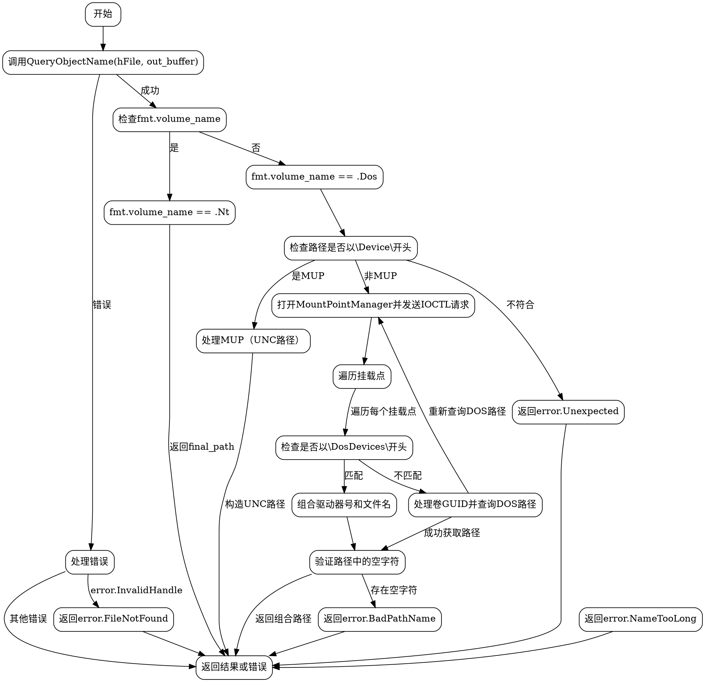

嗯，我需要为这个用Zig编写的GetFinalPathNameByHandle函数画一个流程图。首先，我得先理解这个函数的结构和逻辑流程。函数的主要作用是根据给定的文件句柄和格式（NT或Dos）获取最终路径名。

首先，函数调用了QueryObjectName，可能会返回错误。如果出现错误InvalidHandle，就转换为FileNotFound错误。其他错误则直接返回。这部分应该是流程图的起点，包括错误处理的分支。

接下来，根据fmt.volume_name的不同值（.Nt或.Dos）进行处理。对于.Nt的情况，直接返回final_path，这部分比较简单。

对于.Dos的情况，处理逻辑复杂得多。首先检查路径是否以\Device\开头，如果不是，返回错误。然后分离出卷名和文件名。如果是MUP（UNC路径），则转换为以\\开头的路径。

如果不是MUP，就需要通过DeviceIoControl查询DOS卷名。这里涉及到打开MountPointManager，发送IOCTL请求，处理返回的挂载点。遍历挂载点，寻找以\DosDevices\开头的符号链接，组合驱动器和文件名。如果找到的是卷GUID，需要再次查询DOS卷路径，处理可能的路径覆盖情况，最后合并路径并验证。

整个过程中有很多条件判断和循环，比如遍历mount_points，处理不同的符号链接类型。需要注意错误处理和资源释放，比如使用defer CloseHandle关闭句柄。

在画流程图时，需要将主要的步骤和分支清晰地表示出来，包括错误处理、条件判断、循环结构，以及不同情况下的路径处理。还要注意函数中的关键操作，如内存拷贝、设备控制请求等。

需要确保流程图的结构正确，每个判断框和操作框之间的流向准确，特别是多个嵌套的条件和循环。同时，要注意处理不同错误情况的返回路径，以及资源管理的部分（如关闭句柄）。
================================================
