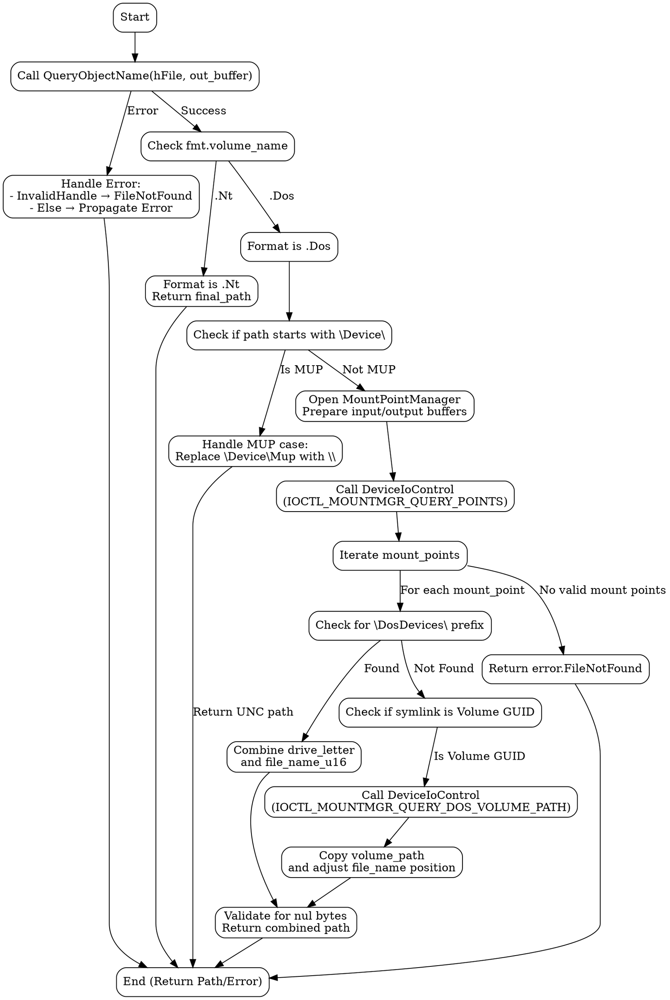

嗯，我需要根据提供的Zig代码绘制一个流程图。首先，我得仔细阅读这段代码，理解它的结构和逻辑。这个函数名为GetFinalPathNameByHandle，处理文件路径的转换，根据不同的格式（NT或Dos）进行不同的处理。

首先，函数开始调用QueryObjectName，如果出错的话会处理错误，比如将InvalidHandle转换为FileNotFound。接着根据fmt.volume_name的值进入不同的分支。如果是.Nt格式，直接返回结果。如果是.Dos格式，则需要进行更复杂的处理，包括解析路径、处理MUP情况、查询DOS卷名等。

在处理.Dos格式时，代码首先检查路径是否以\Device\开头，如果不是则返回错误。然后处理MUP情况，将路径转换为UNC路径。如果不是MUP，则通过DeviceIoControl与MountPointManager通信，获取DOS卷名和路径。这里涉及到多次调用DeviceIoControl，处理不同的情况，比如查找带有\DosDevices\前缀的符号链接，或者处理卷GUID的情况。

在这个过程中，代码需要处理多个可能的错误，比如访问被拒绝、路径过长等，并且需要确保缓冲区足够大，避免数据覆盖问题。最后，如果所有步骤都失败，则返回FileNotFound错误。

现在，我需要将这个过程转化为流程图。流程图应该包括开始、结束节点，判断分支（如NT/Dos格式），各个处理步骤，错误处理，以及循环结构（比如遍历mount_points）。同时需要注意各个步骤之间的逻辑关系和数据流向。

可能的结构如下：
1. 开始
2. 调用QueryObjectName
3. 错误处理
4. 判断fmt.volume_name是NT还是Dos
5. NT分支直接返回路径
6. Dos分支解析路径，处理MUP情况
7. 如果不是MUP，查询MountPointManager获取DOS卷名
8. 遍历mount_points，查找合适的符号链接
9. 处理找到的符号链接或卷GUID
10. 错误处理和返回结果

需要确保每个判断节点（如if/else，switch case）都有对应的分支，循环结构清晰，错误处理路径明确。使用graphviz的节点和箭头来表示这些步骤和逻辑关系。
================================================
