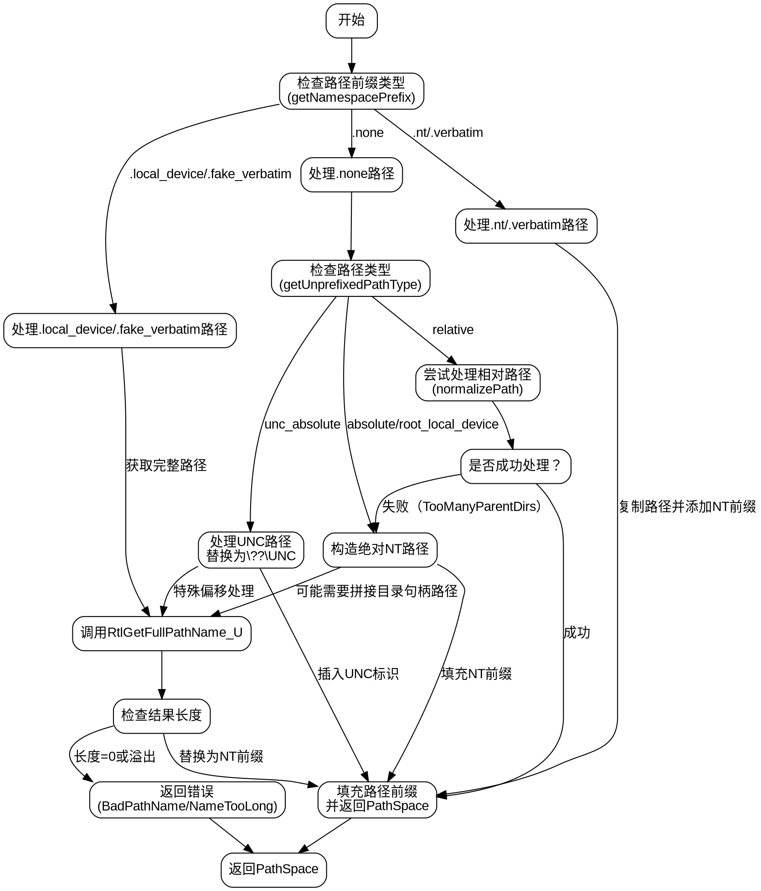

好的，我需要为给定的Zig函数`wToPrefixedFileW`绘制一个流程图。首先，我需要理解这个函数的结构和逻辑流程。

函数的主要功能是将Windows路径转换为带有特定前缀的NT路径格式。它处理不同类型的路径前缀（如nt、verbatim、local_device等），并调用不同的系统API来处理这些路径，比如`RtlGetFullPathName_U`和`GetFinalPathNameByHandle`。

首先，我会将函数分解为主要的步骤：

1. 检查路径的前缀类型（通过`getNamespacePrefix`）。
2. 根据不同的前缀类型进入不同的处理分支：
   - 对于`.nt`和`.verbatim`，直接复制路径并添加NT前缀。
   - 对于`.local_device`和`.fake_verbatim`，使用`RtlGetFullPathName_U`获取完整路径，然后替换前缀。
   - 对于`.none`，进一步检查路径类型（绝对、相对、UNC等），并进行相应的处理，包括处理相对路径、UNC路径，以及可能需要调用`GetFinalPathNameByHandle`来获取目录句柄的绝对路径。

接下来，我需要确定每个分支中的关键判断和操作，例如：
- 在`.none`情况下，是否处理相对路径，如何通过`normalizePath`处理，以及可能的错误处理。
- 处理UNC路径时，如何构造`\??\UNC\`格式。
- 使用`RtlGetFullPathName_U`时的缓冲区管理和错误检查。

需要注意的条件和循环：
- `switch`语句根据前缀类型分支。
- 在`.none`情况下，`relative`标签块内的处理，可能跳出到使用`RtlGetFullPathName_U`。
- 处理UNC路径时的特定偏移计算和字符串操作。

可能的错误情况：
- 路径过长（`error.NameTooLong`）。
- 路径无效（`error.BadPathName`）。
- 无法处理相对路径时回退到系统调用。

最后，将这些步骤和条件用Graphviz的节点和边表示，确保逻辑流程清晰，每个判断点都有明确的分支，操作步骤正确连接。需要特别注意函数中的嵌套条件和可能的分支路径，确保流程图覆盖所有可能的情况。
================================================
