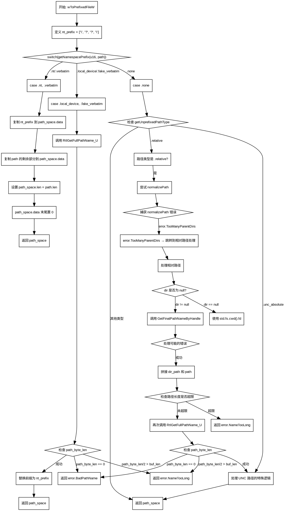

嗯，我需要为这个Zig函数绘制流程图。首先，我得理解这个函数的结构和逻辑。函数名是wToPrefixedFileW，看起来是处理Windows路径转换的。

函数一开始定义了nt_prefix，然后根据getNamespacePrefix的结果进入不同的分支。第一个分支处理.nt和.verbatim的情况，直接复制路径并添加前缀。第二个分支处理.local_device和.fake_verbatim，使用RtlGetFullPathName_U获取完整路径，再替换前缀。第三个分支处理.none的情况，这里又分相对路径、根设备路径、UNC路径等不同子情况。

接下来，我需要理清各个条件判断和循环。例如，在.none分支中，首先检查路径类型是否为相对路径，如果是，尝试规范化路径；如果失败则转向其他处理。然后处理UNC路径时需要特殊处理，添加UNC标识。同时，还有对dir参数是否为空的判断，以及调用GetFinalPathNameByHandle获取目录路径的情况。

绘制流程图时，需要将各个条件分支用菱形框表示，处理步骤用矩形框，流程线连接各个部分。可能需要分层处理，先处理大的switch分支，再深入每个case中的子条件。

需要注意的是，函数中有多个错误处理点，如返回error.BadPathName或error.NameTooLong，这些也需要在流程图中体现。另外，函数中的注释提到了TODO项，可能影响流程图的结构，但暂时按当前代码处理。

最后，确保流程图的逻辑清晰，每个判断和处理步骤都正确对应代码的结构。可能需要多次检查各个分支的连接是否正确，特别是嵌套的条件和循环部分。
================================================
