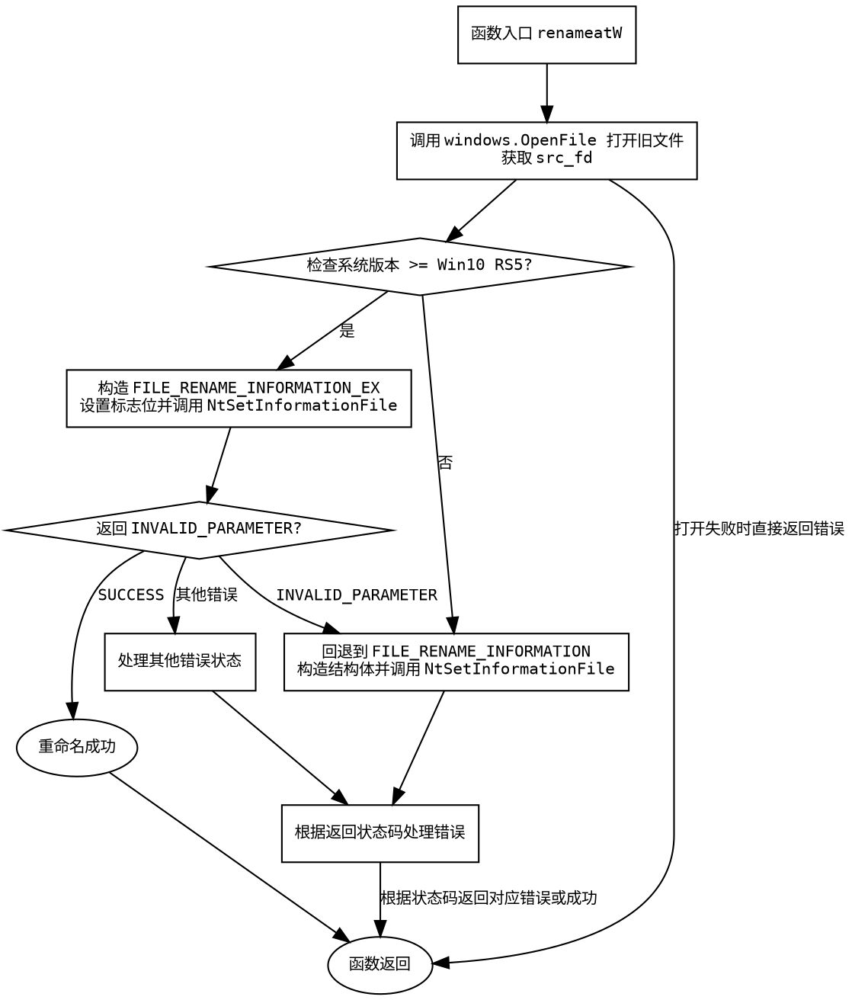

好的，我需要为这个Zig函数`renameatW`生成一个Graphviz的流程图。首先，我需要理解这个函数的结构和逻辑流程。

首先，函数接收几个参数，包括旧的目录文件描述符、旧路径、新的目录文件描述符、新路径，以及是否替换存在的文件。然后，它尝试使用Windows的API来重命名文件或目录。

函数开始时，调用`windows.OpenFile`打开旧路径的文件，获取文件描述符`src_fd`，然后使用`defer`确保之后关闭这个句柄。接下来，设置一个变量`need_fallback`为true，用于判断是否需要回退到旧的重命名方法。

然后，检查系统版本是否为Windows 10 RS5或更高。如果是，尝试使用`FILE_RENAME_INFORMATION_EX`结构体进行高级重命名操作。这里会设置一些标志位，比如是否替换已存在的文件，忽略只读属性等。如果这一步成功，函数直接返回；如果失败（比如返回`INVALID_PARAMETER`），则继续执行回退逻辑。

如果需要回退，或者系统版本不支持高级方法，函数会使用旧的`FILE_RENAME_INFORMATION`结构体进行重命名操作。同样会设置相应的标志，并调用`NtSetInformationFile`。

最后，根据返回的状态码`rc`处理不同的错误情况，比如访问被拒绝、文件未找到、路径已存在等。

现在，我需要将这些步骤转化为流程图。流程图的节点应该包括函数入口、打开文件、判断系统版本、尝试高级重命名、检查结果、回退到旧方法、处理错误状态等。每个判断条件需要有分支，比如系统版本是否满足、高级重命名是否成功等。

需要注意的是，在高级重命名失败的情况下，如果错误码不是`INVALID_PARAMETER`，则不需要回退，直接处理错误。否则，需要执行回退逻辑。而无论高级重命名是否尝试，最终都需要处理返回的状态码。

在绘制流程图时，需要正确连接各个步骤，使用菱形表示判断条件，矩形表示操作步骤，箭头表示流程方向。同时，确保错误处理和回退逻辑的路径清晰可见。

最后，确保使用Graphviz的DOT语法来编写流程图，避免使用Mermaid语法。例如，使用`digraph`定义图，节点用形状标识，边用箭头连接。
================================================

该流程图使用 Graphviz DOT 语言描述，关键节点包含：

1. **版本检查分支**：优先尝试使用 Win10 RS5+ 的扩展重命名逻辑
2. **双路径设计**：支持高级重命名和回退重命名两种实现
3. **分层错误处理**：
   - 打开文件时的错误直接返回
   - 扩展重名的参数错误会触发回退
   - 最终统一处理 NTSTATUS 状态码
4. **资源管理**：通过 `defer` 确保文件句柄关闭（在代码层面体现，流程图中未显式展示）

可以使用 Graphviz 工具生成 PNG/SVG 等格式的可视化流程图。