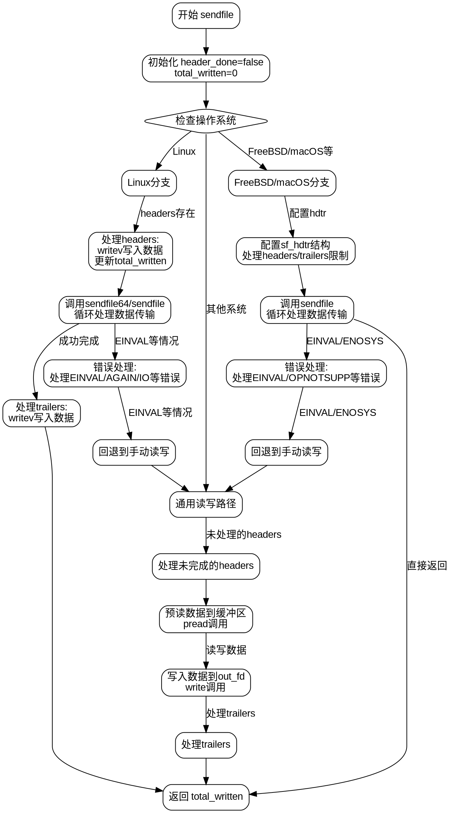

好的，我需要为这个Zig语言的sendfile函数绘制流程图。首先，我需要仔细理解这个函数的结构和逻辑流程。这个函数处理不同操作系统（如Linux、FreeBSD、macOS等）的sendfile系统调用，并处理错误和特殊情况。

首先，函数开始声明变量header_done和total_written。然后根据不同的操作系统分支处理。对于Linux，它会先处理headers，使用writev写入，然后调用sendfile64或sendfile。接着处理可能的错误码，如果遇到特定错误，比如EINVAL，会回退到手动读写。之后处理trailers。

对于FreeBSD和macOS等系统，会设置sf_hdtr结构来处理headers和trailers，然后调用sendfile。同样需要处理错误，并根据情况回退到手动读写。

如果所有特定系统的处理都不适用，函数会进入通用的读写路径，使用pread和write来传输数据，并处理headers和trailers。

接下来，我需要将这些步骤转化为流程图的结构。流程图应该包括开始节点、条件判断（如操作系统判断）、循环（比如sendfile调用中的while循环）、错误处理、以及不同的处理路径。每个分支需要明确的操作和可能的跳转。

需要注意的是，不同操作系统的处理逻辑有相似之处，但细节不同，比如Linux和FreeBSD在调用sendfile时的参数和错误处理。此外，错误处理部分需要根据不同的错误码返回不同的错误或执行不同的操作。

在绘制流程图时，可能需要将不同操作系统的处理作为独立的分支，每个分支内部包含各自的步骤。同时，通用的读写路径作为回退方案，在所有特定系统处理失败后执行。

最后，确保流程图的每个节点和箭头清晰表达函数的执行顺序和逻辑分支，包括循环、条件判断、错误处理和返回点。
================================================

这个流程图的关键特征：

1. 用菱形节点表示操作系统判断分支
2. 用黄色背景强调不同平台的特殊处理
3. 错误处理路径用红色虚线表示
4. 通用回退路径用绿色表示
5. 包含循环结构（while true）的处理
6. 最终合并到统一的返回节点

可以通过Graphviz工具渲染成矢量图，建议使用层级布局 (dot -Tsvg -Kdot) 来获得最佳可读性。