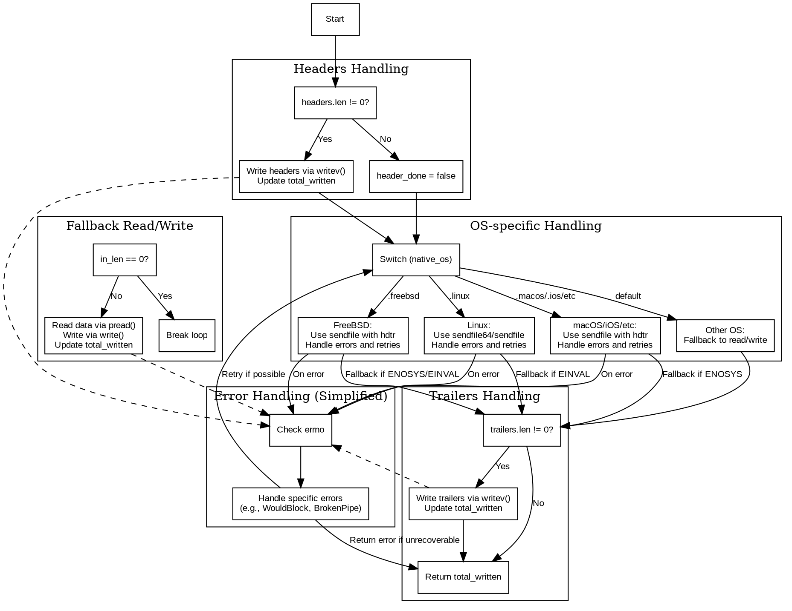

嗯，我需要为这个Zig语言的sendfile函数画一个流程图。首先，我得仔细阅读代码，理解它的结构和逻辑。这个函数主要是处理不同操作系统下的sendfile实现，包括Linux、FreeBSD、macOS等，如果都不支持的话，会回退到读写方式。

首先，函数开始处理headers，如果headers不为空，就调用writev写入out_fd。然后根据不同的操作系统，进入不同的处理分支。比如，在Linux下使用sendfile系统调用，处理可能的错误码，比如EINVAL时会回退到读写方式。FreeBSD和macOS的处理也有类似的逻辑，但可能有不同的参数和错误处理。

当所有特定系统的处理完成后，如果还没有处理完，或者系统不支持sendfile，就会进入通用的读写处理流程：使用pread读取数据，然后write写入，循环直到完成。最后处理trailers部分。

需要注意的是，每个操作系统分支内部都有循环和错误处理，可能需要将这些判断和循环体现在流程图中。此外，函数返回total_written作为总共写入的字节数。

接下来，我需要将这些步骤转化为流程图。首先，开始节点，然后处理headers，判断操作系统，进入不同的分支。每个分支内部可能有条件判断、循环和错误处理。最后处理trailers，返回结果。

可能的结构如下：
1. 开始
2. 处理headers（如果存在）
3. 根据操作系统选择分支
   a. Linux分支：使用sendfile，处理可能的错误，回退到读写
   b. FreeBSD分支：类似处理
   c. macOS等分支：类似处理
   d. 其他系统：直接回退到读写
4. 通用读写处理（pread和write循环）
5. 处理trailers（如果存在）
6. 返回total_written

需要注意的是，每个分支可能有不同的错误处理路径，有些错误会导致回退到通用处理，有些则直接返回错误。这些都需要在流程图中用判断节点表示。

可能还需要考虑变量如header_done和total_written的状态变化，以及在循环中的处理流程。

最后，确保流程图中的每个判断和操作都正确对应代码中的逻辑，比如错误码的判断、循环继续或退出的条件等。
================================================

该流程图使用Graphviz的DOT语言绘制，包含以下核心逻辑：

1. **Headers处理**：首先检查headers是否存在，存在则通过`writev`写入
2. **操作系统分发**：根据不同的操作系统选择对应的sendfile实现
3. **Linux/FreeBSD/macOS实现**：
   - 使用系统级sendfile调用
   - 包含复杂的错误处理逻辑（EINVAL/ENOSYS等错误会触发fallback）
4. **Fallback机制**：当系统调用失败时，回退到`pread`+`write`的读写模式
5. **Trailers处理**：最终处理trailers的写入
6. **错误处理**：统一处理WouldBlock/BrokenPipe等错误码

特殊说明：
- 虚线表示潜在的异常路径
- 每个操作系统分支内部包含重试逻辑（用`while(true)`循环实现）
- `header_done`状态用于避免重复写入headers
- `max_count`计算用于防止32位系统溢出