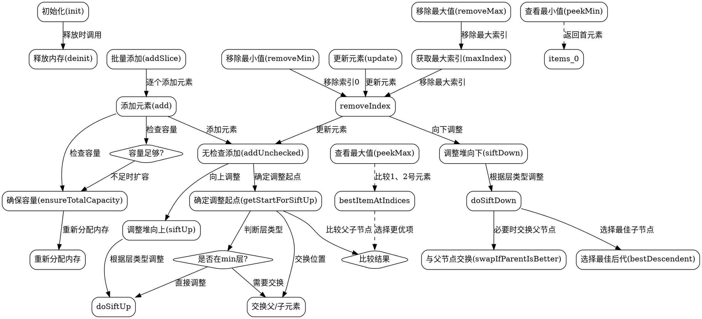

好的，我需要为这个Zig语言实现的PriorityDequeue生成流程图。首先，我需要理解代码的结构和各个函数的作用。这个PriorityDequeue似乎是一个基于最小-最大堆（min-max heap）的双端优先队列，支持插入、删除最小/最大元素等操作。

首先，我会从主结构开始分析。结构体由多个函数组成，包括初始化（init）、释放内存（deinit）、添加元素（add、addSlice）、删除元素（removeMin、removeMax）、维护堆结构的内部函数（siftUp、siftDown）等。

接下来，我需要确定流程图的起点和各个节点之间的逻辑关系。通常，流程图从初始化开始，然后根据操作分为不同的分支，比如插入元素、删除元素等。每个操作内部可能涉及多个步骤，比如调整堆结构。

对于插入操作（add和addSlice），流程大致是：检查容量，添加元素到数组末尾，然后通过siftUp调整元素位置以维持堆性质。siftUp函数会根据当前元素所在的层（min层或max层）决定如何调整。

删除操作（removeMin、removeMax）则需要替换根节点或最后一个元素，然后通过siftDown调整堆。siftDown同样需要根据当前层决定比较的方向。

此外，还有ensureTotalCapacity、shrinkAndFree等内存管理函数，这些在流程图中可能作为辅助流程出现。

在绘制流程图时，需要注意函数之间的调用关系，比如add调用ensureUnusedCapacity和addUnchecked，而addUnchecked又调用getStartForSiftUp和siftUp。每个判断条件（如比较结果、层类型判断）也需要在流程图中体现。

最后，需要确认各个函数的出口和可能的错误处理，比如内存分配失败时的错误返回。

总结步骤：
1. 确定主流程（初始化、插入、删除、内存管理）。
2. 分解每个主要函数的内部步骤。
3. 绘制函数之间的调用关系。
4. 标注条件判断和循环结构。
5. 确保所有可能的执行路径都被覆盖。

在绘制过程中，可能会发现某些复杂的逻辑需要进一步细化，比如siftUp和siftDown的具体调整步骤，这些需要单独的子流程图来表示。

现在，我可以根据以上分析开始绘制流程图，使用Graphviz的节点和边来表示各个步骤和判断条件。
================================================


这个流程图展示了`PriorityDequeue`的主要操作和内部函数调用关系。使用以下命令生成图片：

```bash
dot -Tpng priority_dequeue.dot -o priority_dequeue.png
```

关键路径说明：
1. **插入元素**时先检查容量，然后通过`siftUp`维护堆结构
2. **删除元素**时通过`siftDown`维护堆结构
3. 堆调整过程中需要根据当前层类型（min/max）选择不同的比较方向
4. 内存管理贯穿整个生命周期
5. 复杂的选择逻辑通过`bestItemAtIndices`和`bestDescendent`实现

图中菱形节点表示条件判断，矩形节点表示操作步骤，虚线表示次要或间接调用关系。