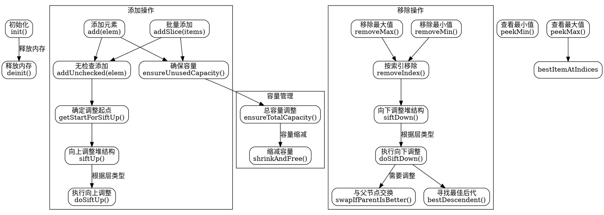

好的，我需要帮助用户为提供的Zig代码生成一个Graphviz流程图。首先，我需要理解这段代码的结构和功能。

这段代码定义了一个名为`PriorityDequeue`的结构体，它是一个优先队列，支持插入元素、删除最小或最大元素等操作。内部使用了一种称为“最小-最大堆”的数据结构。代码中有多个方法，包括初始化、释放内存、添加元素、删除元素、调整堆结构等。

接下来，我需要确定如何将这些方法组织成流程图。流程图通常从主函数或入口点开始，展示各个步骤和决策点。对于这种数据结构，可以从初始化开始，然后展示添加元素、删除元素等操作的过程，以及内部调整堆的方法如`siftUp`和`siftDown`。

不过，用户可能希望的是整个`PriorityDequeue`结构的整体流程图，而不是每个方法的详细流程。因此，我应该首先确定主要的方法和它们之间的调用关系，然后将其可视化。

主要方法包括：
1. `init`：初始化队列。
2. `deinit`：释放内存。
3. `add`和`addSlice`：添加元素。
4. `removeMin`和`removeMax`：删除元素。
5. `siftUp`和`siftDown`：内部调整堆结构。
6. `peekMin`和`peekMax`：查看元素。
7. 其他辅助方法如`ensureCapacity`、`shrinkAndFree`等。

需要注意的是，Graphviz使用DOT语言来描述图表，因此我需要将这些方法之间的关系用节点和边表示出来。例如，`add`方法会调用`ensureUnusedCapacity`和`addUnchecked`，而`addUnchecked`又会调用`getStartForSiftUp`和`siftUp`。

另外，错误处理也是需要考虑的部分，比如`add`方法可能返回错误，需要体现在流程图中。

可能需要分层展示，将主要操作（如添加、删除）作为顶层节点，然后展开每个操作的子步骤。例如：

- 添加元素流程：
  - 检查容量
  - 插入元素到数组末尾
  - 执行`siftUp`调整堆结构

- 删除最小元素流程：
  - 取出根元素
  - 将最后一个元素移到根位置
  - 执行`siftDown`调整堆结构

同时，需要注意条件判断，比如在`siftUp`时根据当前层是min层还是max层决定比较的方向。

在绘制流程图时，需要确保逻辑清晰，节点之间的箭头正确表示执行顺序和条件分支。可能需要对复杂的逻辑进行适当简化，避免图表过于复杂。

最后，生成DOT代码时，要确保语法正确，节点和边的定义无误，使用合适的形状和标签，如矩形表示过程，菱形表示判断等。
================================================

该流程图通过以下方式组织代码逻辑：

1. **初始化与销毁**：展示结构体的生命周期管理
2. **添加操作**：包含容量检查和堆结构调整的全流程
3. **移除操作**：展示最小值/最大值移除时的堆调整逻辑
4. **容量管理**：独立展示内存管理相关操作
5. **关键判断逻辑**：用菱形节点表示层类型判断（min/max层）
6. **核心算法**：突出显示siftUp/siftDown等核心堆调整算法

节点间的箭头表示方法调用顺序，虚线框表示逻辑分组。实际使用时可根据需要展开/折叠子图查看细节。