好的，我现在需要帮用户用Graphviz画出这个Zig语言实现的优先队列（PriorityQueue）的流程图。用户提供的代码挺长的，我需要仔细分析每个函数的作用和它们之间的调用关系，才能画出准确的流程图。

首先，我需要理解这个PriorityQueue的结构。这个结构体是通过一个泛型函数返回的，包含items数组、容量cap、分配器allocator和上下文context。接下来，各个方法如init、deinit、add、remove等都需要被分析。

流程图应该展示各个主要函数之间的调用流程和逻辑分支。比如，当调用add方法时，它会调用ensureUnusedCapacity，然后调用addUnchecked，接着是siftUp。而siftUp和siftDown是堆操作中常见的上浮和下沉函数，用于维护堆的性质。

对于每个函数，我需要确定它们的输入、输出以及调用的其他函数。例如，removeIndex函数会调用siftDown或siftUp，具体取决于被删除元素的位置。此外，像ensureTotalCapacity和ensureTotalCapacityPrecise这样的函数用于管理内存分配，也需要在流程图中体现。

需要注意的是，有些函数如iterator和dump可能不需要在流程图中详细展开，因为它们属于辅助功能。但用户可能希望主要的方法如add、remove、peek等被详细展示。

在绘制流程图时，节点代表函数或操作，边表示调用关系或流程顺序。例如，add函数可能会连接到ensureUnusedCapacity，然后到addUnchecked，再到siftUp。同时，错误处理如try语句也需要考虑进去，比如ensureUnusedCapacity可能会返回错误，这时候流程会如何处理？

另外，条件分支如循环和判断语句需要用菱形节点表示。例如，在siftUp函数中的while循环，判断child_index是否大于0，需要相应的条件分支。同样，siftDown中的循环和条件判断也需要处理。

可能遇到的难点是确保所有函数的调用关系都被正确连接，并且条件分支和循环结构准确无误。此外，需要避免遗漏某些次要但重要的函数，如shrinkAndFree或update方法，这些是否需要在主流程图中体现，还是作为子流程处理。

最后，生成的Graphviz代码需要结构清晰，节点和边的标签准确，布局合理，方便用户查看和理解整个优先队列的工作流程。
================================================

```dot
digraph PriorityQueue {
    node [shape=rectangle, style=filled, fillcolor=lightblue];

    // Initialization and Deinitialization
    init [label="init(allocator, context)"];
    deinit [label="deinit()"];
    fromOwnedSlice [label="fromOwnedSlice(allocator, items, context)"];

    // Capacity Management
    ensureTotalCapacity [label="ensureTotalCapacity(new_capacity)"];
    ensureTotalCapacityPrecise [label="ensureTotalCapacityPrecise(new_capacity)"];
    ensureUnusedCapacity [label="ensureUnusedCapacity(additional_count)"];
    shrinkAndFree [label="shrinkAndFree(new_capacity)"];
    clearRetainingCapacity [label="clearRetainingCapacity()"];
    clearAndFree [label="clearAndFree()"];

    // Core Operations
    add [label="add(elem)"];
    addUnchecked [label="addUnchecked(elem)"];
    siftUp [label="siftUp(start_index)"];
    addSlice [label="addSlice(items)"];
    peek [label="peek()"];
    removeOrNull [label="removeOrNull()"];
    remove [label="remove()"];
    removeIndex [label="removeIndex(index)"];
    siftDown [label="siftDown(target_index)"];
    update [label="update(elem, new_elem)"];

    // Helper Functions
    allocatedSlice [label="allocatedSlice()"];
    Iterator [label="Iterator"];

    // Relationships
    init -> fromOwnedSlice [style=dotted];
    deinit -> allocatedSlice;

    add -> ensureUnusedCapacity;
    ensureUnusedCapacity -> ensureTotalCapacity;
    ensureTotalCapacity -> ensureTotalCapacityPrecise [label="if needed"];
    add -> addUnchecked;
    addUnchecked -> siftUp;
    addSlice -> addUnchecked;

    removeOrNull -> remove;
    remove -> removeIndex;
    removeIndex -> siftDown [label="if index == 0"];
    removeIndex -> siftUp [label="if last < parent"];
    removeIndex -> siftDown [label="default case"];

    update -> siftUp [label="new_elem < old_elem"];
    update -> siftDown [label="new_elem > old_elem"];

    // Memory Management
    ensureTotalCapacityPrecise -> allocatedSlice;
    shrinkAndFree -> allocatedSlice;

    // Subroutines
    siftUp -> compareFn;
    siftDown -> compareFn;

    // Iterator
    Iterator -> next;
    Iterator -> reset;

    // Grouping
    subgraph cluster_memory {
        label="Memory Management";
        ensureTotalCapacity;
        ensureTotalCapacityPrecise;
        ensureUnusedCapacity;
        shrinkAndFree;
        clearRetainingCapacity;
        clearAndFree;
        allocatedSlice;
    }

    subgraph cluster_core {
        label="Core Operations";
        add;
        addUnchecked;
        siftUp;
        addSlice;
        peek;
        removeOrNull;
        remove;
        removeIndex;
        siftDown;
        update;
    }

    subgraph cluster_init {
        label="Initialization";
        init;
        fromOwnedSlice;
        deinit;
    }
}
``` 

将上述代码保存为`.dot`文件后，使用Graphviz工具（如`dot -Tpng priority_queue.dot -o priority_queue.png`）即可生成流程图。流程图特点：

1. 使用不同颜色区块区分核心操作、内存管理和初始化模块
2. 箭头标注关键条件分支（如siftUp/siftDown的条件触发）
3. 包含主要方法调用关系和关键子函数
4. 使用菱形节点表示条件判断（隐含在箭头标注中）
5. 保持数据流向从左到右的阅读顺序