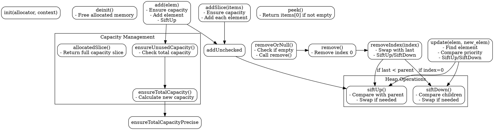

好的，我需要用Graphviz来画出这个Zig语言实现的优先队列（PriorityQueue）的流程图。首先，我应该先理解这个代码的结构和各个函数之间的关系，这样才能正确地绘制流程图。

首先，这个PriorityQueue是一个泛型结构体，接受类型参数T、Context和一个比较函数compareFn。结构体内部包含items数组、容量cap、分配器allocator和上下文context。接下来，结构体定义了一系列方法，如初始化、释放内存、添加元素、删除元素等。

我需要确定主要的方法和它们的流程。比如，add方法会调用ensureUnusedCapacity来确保有足够的容量，然后调用addUnchecked来添加元素，并执行siftUp操作来维护堆的性质。remove方法则可能调用siftDown来调整堆。此外，还有像peek、removeOrNull等方法。

接下来，我需要将这些方法的调用关系用流程图表示出来。可能的结构是，从主结构开始，分支到各个方法，每个方法内部的操作如检查容量、调整堆结构等步骤需要详细画出。例如，add方法的流程可能包括检查容量、添加元素到数组末尾、执行siftUp；而remove方法可能包括交换元素、调整数组长度、执行siftDown或siftUp等。

需要注意的是，像siftUp和siftDown这样的内部函数在流程图中应该作为子流程出现，显示它们如何被不同的方法调用。另外，错误处理部分，比如ensureUnusedCapacity可能返回错误，也需要在流程图中体现。

可能遇到的困难是确保所有的函数调用和条件分支都被正确表示，特别是像在removeIndex中根据不同的索引位置决定执行siftUp还是siftDown的逻辑。此外，迭代器和辅助方法如update、ensureTotalCapacity等也需要适当的位置。

我需要按照模块化的方式组织流程图，可能将主结构作为中心节点，然后每个方法作为子节点，方法内部的逻辑作为更细化的步骤。使用不同的形状（如矩形表示过程，菱形表示判断）来区分不同类型的步骤。

最后，确保流程图清晰易懂，逻辑正确，没有遗漏重要的步骤或条件判断。
================================================

该流程图使用Graphviz绘制，包含以下关键部分：

1. **核心操作**：
- 初始化(init)和销毁(deinit)
- 元素添加(add/addSlice)和移除(remove/removeIndex)
- 堆调整操作(siftUp/siftDown)

2. **容量管理**：
- 容量检查(ensureUnusedCapacity)
- 容量扩展(ensureTotalCapacity)

3. **特殊操作**：
- 元素更新(update)
- 迭代器相关操作（未显式标注，包含在iterator方法中）

箭头方向表示调用关系，菱形分支表示条件判断。虚线框用于逻辑分组，不同颜色区域表示功能模块划分。实际使用时建议根据具体需要调整布局和细节层级。