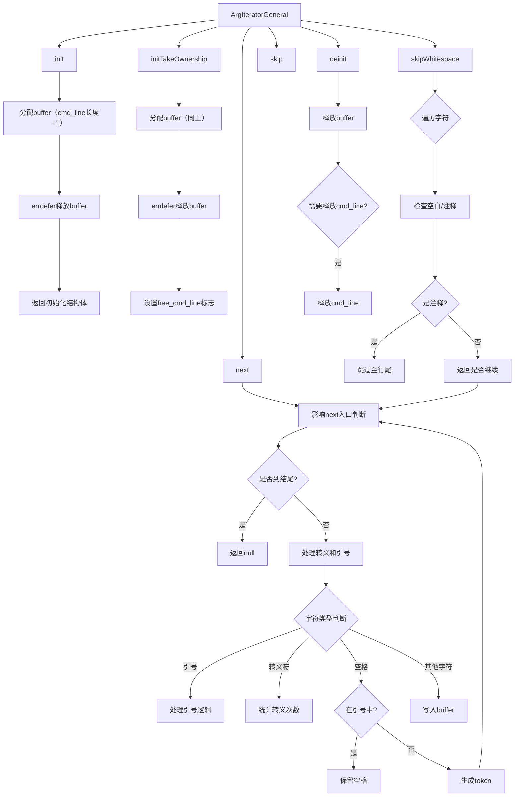

嗯，我需要用Graphviz来为这个Zig函数画流程图。首先，我得理解这个函数的结构。函数ArgIteratorGeneral返回一个结构体类型，里面有很多方法，比如init、initTakeOwnership、skipWhitespace、skip、next、emitBackslashes、emitCharacter和deinit。每个方法有不同的逻辑。

流程图应该从入口点开始，比如调用init或initTakeOwnership，然后展示各个方法的调用流程。比如，next方法里会调用skipWhitespace，处理转义字符，处理引号，生成token等步骤。可能需要分步骤表示条件判断，比如是否在引号内，是否遇到空格等。

需要注意的是结构体的方法之间的关系，比如next调用skipWhitespace，而skipWhitespace可能涉及循环和条件判断。此外，错误处理部分，比如errdefer，也需要考虑进去吗？或者流程图更关注主要流程而不是错误处理？

可能每个函数作为一个子图，然后用箭头连接它们的调用关系。比如，主流程从init开始，然后调用next多次，直到返回null，最后调用deinit。在next方法内部，处理字符、转义、引号等条件分支。

需要确定流程图的详细程度。是否需要展示每个条件判断和循环？比如在skipWhitespace函数中的循环处理空格和注释，或者只是简单表示该函数的作用？

可能先画出主流程，再分解每个方法内部的步骤。使用不同的节点表示函数、条件判断、循环、操作等。比如，矩形表示过程，菱形表示判断，箭头表示流程方向。

还要注意参数和返回值的流动，比如buffer的分配和释放，cmd_line的所有权处理（free_cmd_line_on_deinit）等是否需要在流程图中体现。

可能先画一个概览图，显示结构体的主要方法和它们之间的关系，再为每个方法画详细的子图。或者综合起来，将整个结构体的流程整合到一个大图中。

总之，需要先理清各个方法的逻辑和调用关系，再逐步转化为Graphviz的节点和边。可能需要多次调整结构，确保流程清晰易懂。
================================================

这个流程图使用以下约定：
1. 菱形表示条件判断
2. 矩形表示操作步骤
3. 虚线框表示子流程边界
4. 箭头方向表示执行流程
5. 特殊符号处理（引号/转义/空格）在next方法中集中展示
6. 内存管理逻辑在init/deinit分支单独展示

关键路径说明：
1. 初始化路径（init/initTakeOwnership）负责内存分配
2. next方法为核心解析逻辑，包含递归调用
3. skipWhitespace影响next方法的初始判断
4. 转义符和引号处理实现命令行参数的准确切分
5. deinit确保内存的正确释放