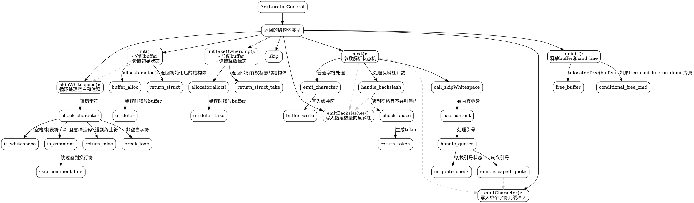

嗯，我需要为给定的Zig函数生成一个Graphviz流程图。首先，我需要理解这个函数的结构和逻辑。

首先，这个函数ArgIteratorGeneral返回一个结构体类型，这个结构体有几个字段，比如allocator、index、cmd_line等。然后结构体有多个方法，比如init、initTakeOwnership、skipWhitespace、skip、next、emitBackslashes、emitCharacter和deinit。

流程图应该从主函数开始，然后分支到各个方法。每个方法内部有逻辑判断和循环，比如skipWhitespace中有循环处理空白和注释，next方法中有处理引号和转义字符的逻辑。需要注意条件判断的分支，比如是否支持注释、单引号等选项。

需要确定各个方法之间的调用关系。例如，next方法调用了skipWhitespace，而skipWhitespace可能因为选项中的comments设置而处理注释。emitBackslashes和emitCharacter是辅助函数，被next调用。

接下来，考虑使用Graphviz的节点和边来表示这些流程。每个方法作为一个节点，内部的处理步骤可以分解为子节点或注释。条件判断用菱形节点，循环用箭头回指。

需要注意的是，Graphviz的语法结构，比如使用digraph，定义节点和边。可能需要为每个函数内部逻辑创建子图，但Graphviz的subgraph主要用于布局，可能不太适合详细步骤。因此，可能需要将主要步骤作为节点，用箭头连接，并在边上标注条件。

例如，主函数ArgIteratorGeneral作为入口，然后调用init或initTakeOwnership。这两个方法初始化结构体，分配buffer。然后next方法处理参数解析，其中涉及skipWhitespace和字符处理，包括引号、转义符等。

在绘制时，需要确保逻辑顺序正确，条件分支明确。可能比较复杂的是next方法中的各种情况处理，需要分解成多个步骤，并用条件判断连接。

此外，deinit方法负责释放资源，应该在流程图中有一个结束节点表示资源释放。

现在，我需要将这些思考转化为具体的Graphviz代码，确保节点和边的正确连接，逻辑清晰，避免遗漏重要步骤。
================================================
