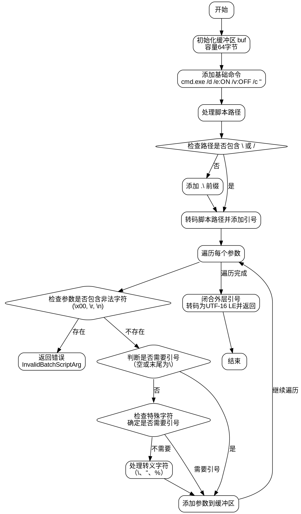

好的，我需要帮用户分析这个Zig函数，并生成对应的流程图。首先，我得理解这个函数的功能和结构。

这个函数叫做`argvToScriptCommandLineWindows`，看起来是处理Windows下的命令行参数，特别是构建一个执行批处理脚本的命令行字符串。函数接受一个分配器、脚本路径和参数，返回一个以null结尾的UTF-16字符串或者错误。

接下来，我需要逐步分析函数的逻辑：

1. 初始化一个缓冲区`buf`，容量为64字节。
2. 向缓冲区添加固定的命令部分：`cmd.exe /d /e:ON /v:OFF /c "`，这部分可能是一些安全参数。
3. 处理脚本路径：
   - 检查路径是否包含路径分隔符（\或/），如果没有，则在路径前添加`.\`，确保从当前目录执行。
   - 将脚本路径转码为UTF-16 LE并添加到缓冲区，同时用双引号包裹。
4. 处理每个脚本参数：
   - 检查参数是否包含非法字符（如NUL、回车、换行），如果有则返回错误。
   - 判断是否需要给参数加引号，比如参数为空或以反斜杠结尾的情况，或者包含特殊字符。
   - 对参数中的特殊字符进行转义处理，特别是双引号和百分号。对于百分号，使用`%%cd:~,%`来防止环境变量扩展。
5. 最后闭合外层的双引号，并将缓冲区内容转换为UTF-16 LE格式返回。

在画流程图时，需要将这些步骤转化为不同的节点，包括条件判断和循环处理。可能的节点包括：

- 开始
- 初始化缓冲区
- 添加基础命令
- 处理脚本路径（判断是否有分隔符，添加前缀）
- 遍历参数
  - 检查非法字符
  - 判断是否需要引号
  - 处理转义字符
- 结束处理，转换编码并返回

需要注意条件分支，比如路径是否有分隔符，参数是否需要引号，以及处理转义时的不同情况。此外，循环处理每个参数也是一个重要的部分。

现在需要将这些步骤结构化为流程图，使用Graphviz的语法，确保每个步骤和判断正确连接。例如，处理参数的循环可能需要一个循环结构，但Graphviz中通常用节点和边来表示流程，可能需要使用条件节点和箭头来展示循环过程。

最后，确保流程图没有使用Mermaid语法，而是正确的Graphviz DOT语言。
================================================
