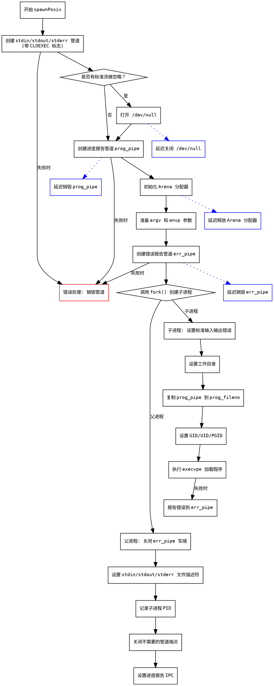

嗯，我现在需要为这个Zig语言写的函数生成一个流程图，使用Graphviz。首先，我需要理解这个函数的结构和逻辑流程。

这个函数是spawnPosix，属于ChildProcess结构体的方法。看起来它负责启动一个子进程，设置管道、处理标准输入输出错误，以及处理环境变量和错误报告等。我需要逐步分析函数的执行步骤。

首先，函数开始时创建了三个可能的管道：stdin_pipe、stdout_pipe、stderr_pipe，每个管道根据对应的行为（Pipe或非Pipe）来决定是否创建。每个管道创建后都有errdefer来确保在错误时销毁。这部分可能需要条件判断的节点。

接下来，处理/dev/null的情况，如果任何标准流被忽略，就会打开/dev/null文件描述符。这里有一个条件判断，是否有任何ignore行为，然后打开/dev/null，并在defer中关闭。

然后处理prog_pipe，这可能与进度报告有关。根据条件是否创建管道，同样带有errdefer。

接下来是分配内存的步骤，使用arena_allocator，准备argv和envp参数，用于后续的execve调用。这里可能有多个步骤，比如分配argv_buf，复制参数，处理环境变量等。

之后创建err_pipe，用于子进程和父进程之间的错误通信。然后调用posix.fork()，分支出子进程和父进程。

在子进程分支中，设置各种IO（标准输入、输出、错误），可能改变工作目录，设置gid、uid、pgid，最后执行execvpe来运行新程序。如果中间出现错误，通过err_pipe报告。

在父进程分支中，关闭不需要的管道端，设置子进程的stdin、stdout、stderr，记录pid，并关闭多余的管道描述符。

整个过程需要处理很多条件判断和错误处理，比如各种errdefer和defer语句。流程图需要反映这些分支和步骤，包括条件判断、循环（如果有的话）、函数调用以及错误处理路径。

可能的挑战是准确捕捉所有的条件分支和错误处理步骤，并将它们转换为Graphviz的节点和边。需要特别注意fork之后子进程和父进程的不同路径，以及各个管道和文件描述符的处理。

现在，我需要将这些步骤转化为Graphviz的节点和连接。使用不同的形状表示不同的操作类型，比如菱形表示条件判断，矩形表示操作步骤，并行处理子进程和父进程的分支，并确保错误处理路径正确连接。

可能还需要处理一些细节，比如在创建管道时是否带有CLOEXEC标志，以及在子进程中如何设置文件描述符的复制（dup2）。这些步骤虽然重要，但可能在流程图中以简化的方式表示，避免过于复杂。

最后，确保流程图的结构清晰，层次分明，能够直观地展示函数的执行流程，包括错误处理和资源清理的步骤。
================================================
